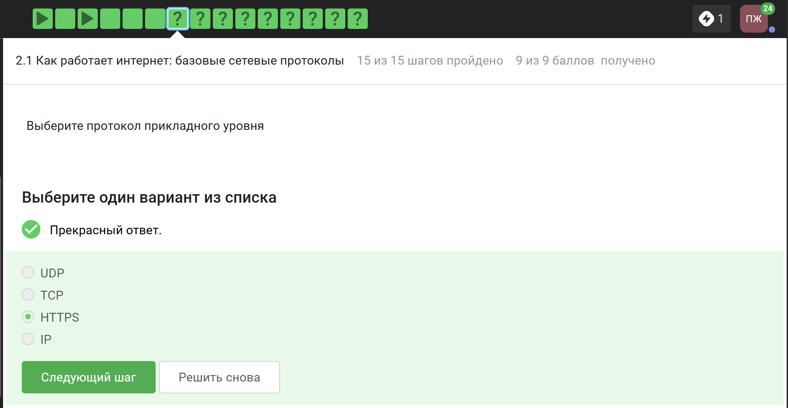
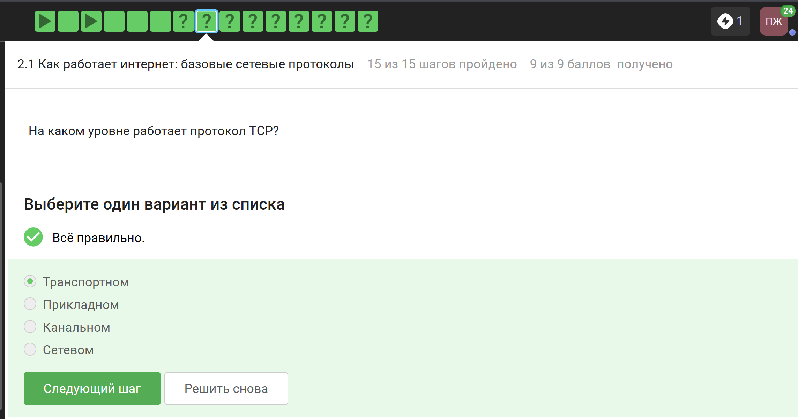
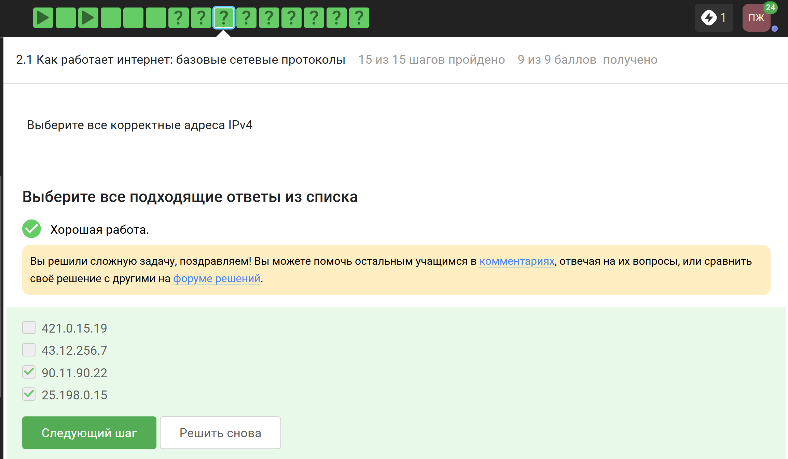
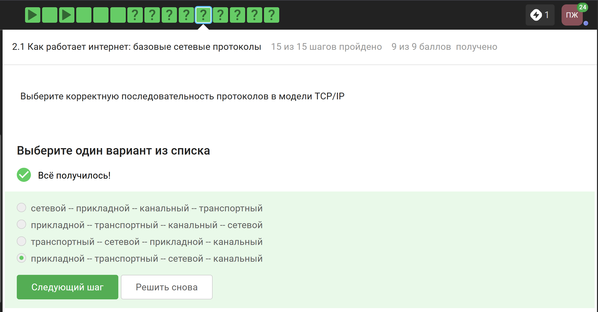
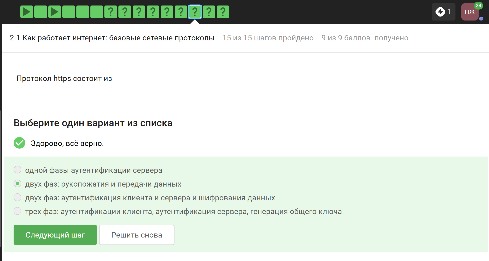

---
## Author
author:
  name: Панина Жанна Валерьевна
  degrees: бакалавр
  orcid: 
  email: 1132246710@rudn.ru
  affiliation:
    - name: Российский университет дружбы народов
      country: Российская Федерация
      postal-code: 
      city: Москва
      address: ул. Миклухо-Маклая, д. 6
## Title
title: Индивидуальный проект
subtitle: 1 Этап
license: CC BY
date: today
date-format: "2026-03-06" 
---

# Информация

## Докладчик

:::::::::::::: {.columns align=center}
::: {.column width="70%"}

  Панина Жанна Валерьевна
  студентка НКАбд-02-24
  Российский университет дружбы народов им. П. Лумумбы
  [1132246710@rudn.ru](mailto:1132246710@rudn.ru)
  <https://github.com/zvpanina/study_2025-2026_infosec-intro>

:::
::::::::::::::

# Вводная часть

## Актуальность

Актуальность работы обусловлена необходимостью обеспечения безопасности веб-приложений и выявления их уязвимостей с помощью специализированных инструментов.

## Объект и предмет исследования

### Объект исследования:
Веб-приложение Damn Vulnerable Web Application.

### Предмет исследования:
Уязвимости веб-приложений и методы их обнаружения.

## Цели и задачи

Цель - научиться основным способам тестирования веб приложений

Задание: Найти максимальное количество уязвимостей различных типов. Реализовать успешную эксплуатацию каждой уязвимости.

## Материалы и методы

Дистрибутив Kali Linux, виртуальная машина VirtualBox, методы тестирования безопасности веб-приложений.

# Основная часть

Захожу на официальный сайт Kali Linux и устанавливаю необходимый дистрибутив ([рис. @fig-001]). Выбираю Virtual Machies ([рис. @fig-002]), VirtualBox в качестве среды виртуализации ([рис. @fig-003])

{#fig-001 width=70%}

##

{#fig-002 width=70%}

##

{#fig-003 width=70%}

##

Распаковываю архив и открываю файл .vbox ([рис. @fig-004]).

{#fig-004 width=70%}

##

Вижу созданную виртуальную машину Kali ([рис. @fig-005]).

{#fig-005 width=70%}

##

Ввожу учётные данные по умолчанию: логин root и пароль toor ([рис. @fig-006]).

{#fig-006 width=70%}

##

К сожалению, под этими данными войти не удалось, поэтому использую логин kali и пароль kali ([рис. @fig-007]).

{#fig-007 width=70%}

# Вопросы

1. Основные уязвимости веб-приложений:
SQL-инъекции, XSS (межсайтовый скриптинг), CSRF (межсайтовая подделка запроса), ошибки аутентификации, ошибки контроля доступа, небезопасная конфигурация сервера.

2. Можно ли ставить DVWA на публичный сервер?
Нет. Damn Vulnerable Web Application содержит специально созданные уязвимости и предназначен только для учебной среды.

3. Отличие тестирования DVWA от тестирования публичного сервера:
DVWA тестируется в учебных целях с известными уязвимостями; тестирование публичного сервера требует разрешения владельца и проводится по правилам безопасности.

4. Что такое Kali Linux:
Kali Linux — специализированный дистрибутив Linux для тестирования безопасности и поиска уязвимостей.

##

5. Компоненты Kali Linux:

* Nmap — сканирование сети.
* Metasploit Framework — эксплуатация уязвимостей.
* Wireshark — анализ сетевого трафика.
* Burp Suite — тестирование веб-приложений.
* John the Ripper — проверка стойкости паролей.

## Результаты

На первом этапе проекта я установила дистрибутив Kali Linux на виртуальную машину и настроила её.

