---
## Author
author:
  name: Панина Жанна Валерьевна
  degrees: bachelor
  orcid: 
  email: 1132246710@rudn.ru
  affiliation:
    - name: Российский университет дружбы народов
      country: Российская Федерация
      postal-code: 
      city: Москва
      address: ул. Миклухо-Маклая, д. 6

## Title
title: "Внешний курс. Блок 1: Безопасность в сети"
subtitle: "Основы информационной безопасности"
license: "CC BY"
---

# Цель работы

Выполнение контрольных заданий первого блока внешнего курса "Основы кибербезопасности". В ходе выполнения контрольных заданий использовались материалы курса [@stepik_infosec].

# Выполнение заданий 1 блока

## Как работает интернет: базовые сетевые протоколы 

UDP - протокол сетевого уровня; TCP - протокол транспортного уровня, IP - протокол сетевого уровня, правильный ответ - HTTPS, это протокол транспортного уровня ([рис. @fig-001]). 

{#fig-001 width=70%}

Протокол TCP - Transmission Control Protocol, он работает на транспортном уровне ([рис. @fig-002]). 

{#fig-002 width=70%}

В адресе типа IPv4 не может быть чисел больше 255, значит, первые два варианта неправильные ([рис. @fig-003]). 

{#fig-003 width=70%}

DNS - Domain Name Server - приложение, предназначенное для ответов на DNS-запросы по соответствующему протоколу. Обязательное условие - сопоставление сервером доменных имён с IP-адресами - разрешение имени и адреса ([рис. @fig-004]). 

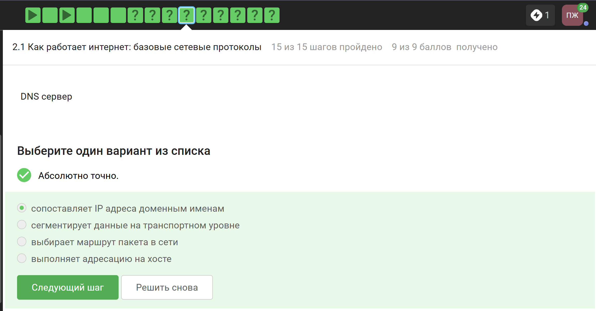{#fig-004 width=70%}

Распределение протоколов в модели TCP/IP:

- Прикладной уровень: HHTP, RTSP, FTP, DNS
- Транспортный уровень: TCP, UDP, SCTP, DCCP
- Сетевой уровень: IP
- Канальный уровень: Ethernet, IEEE 802.11, WLAN, SLIP, Token Ring, ATM, MPLS ([рис. @fig-005]). 

{#fig-005 width=70%}

Протокол http передаёт незашифрованные данные, а протокол https уже будет передавать их в зашифрованном виде ([рис. @fig-006]). 

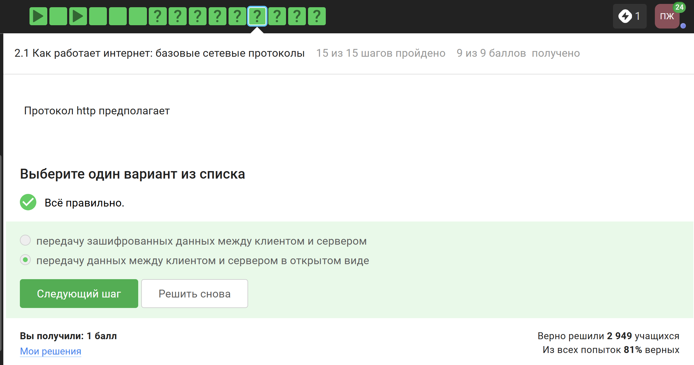{#fig-006 width=70%}

Протокол https передаёт зашифрованные данные, одна из фаз - передача данных, другая - рукопожатие ([рис. @fig-007]). 

{#fig-007 width=70%}

TLS определяется и клиентом, и сервером, чтобы было возможно подключиться ([рис. @fig-008]). 

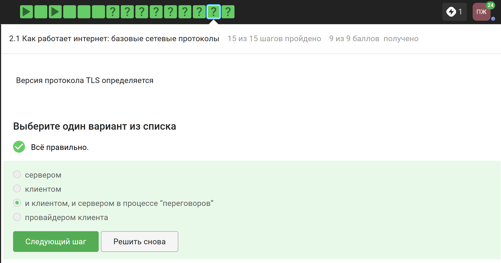{#fig-008 width=70%}

Не предусмотрено из перечисленных вариантов только шифрование данных ([рис. @fig-009]). 

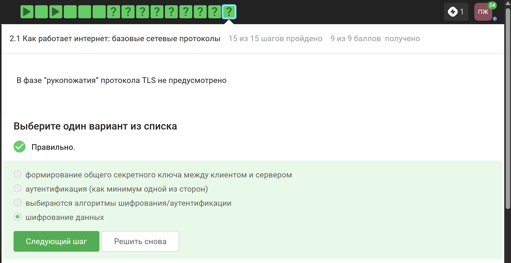{#fig-009 width=70%}

## Перслнализация сети

Куки точно не хранят пароли и IP-адреса, а ID сессии и идентификатор хранят ([рис. @fig-010]). 

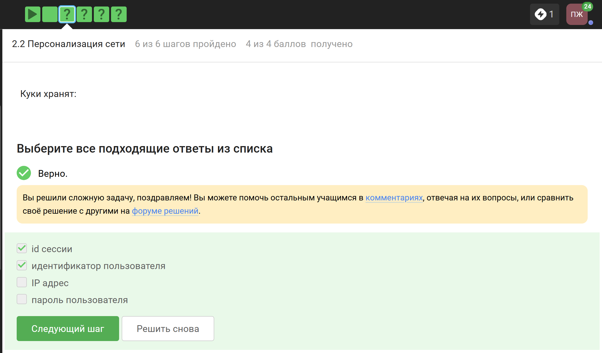{#fig-010 width=70%}

Естественно куки не делают соединение более надёжным ([рис. @fig-011]). 

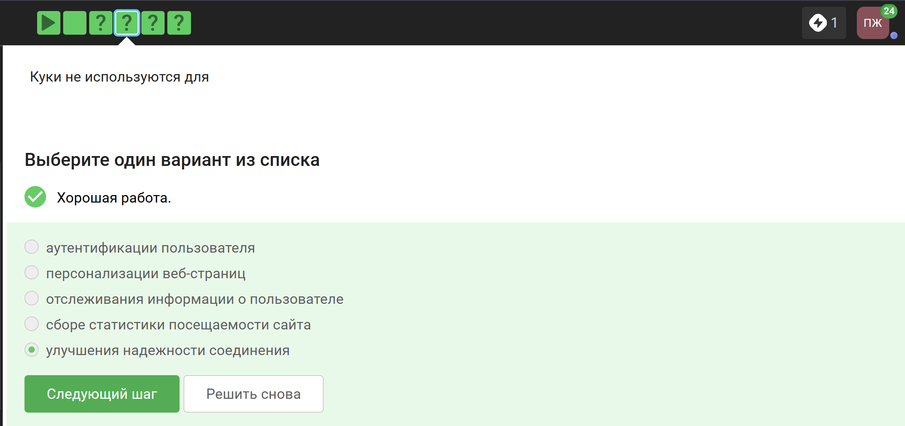{#fig-011 width=70%}

Ответ представлен на изображении ([рис. @fig-012]). 

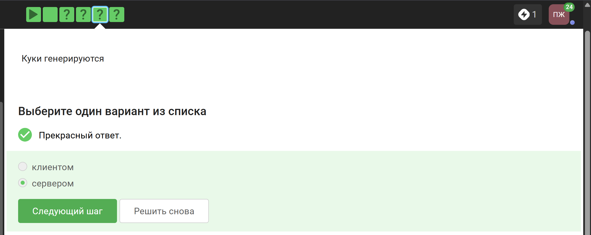{#fig-012 width=70%}

Сессионные куки хранятся в течение сессии, то есть, пока используется веб-сайт ([рис. @fig-013]). 

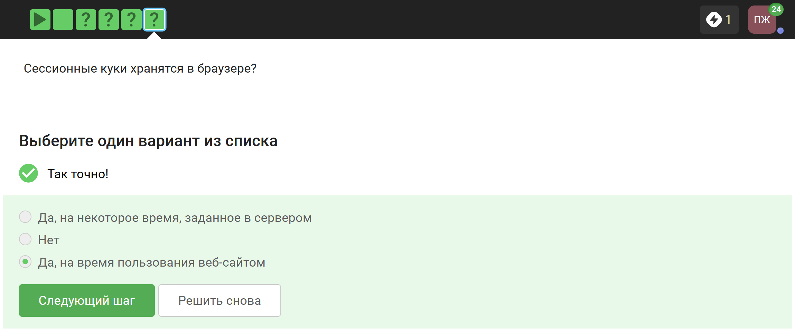{#fig-013 width=70%}

## Браузер TOR. Анонимизация

Необходимо три узла - входной, промежуточный и выходной ([рис. @fig-014]). 

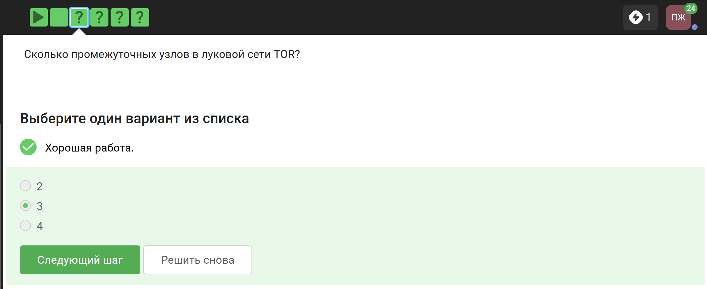{#fig-014 width=70%}

IP-адрес не должен быть известен охранному и промежуточному узлам ([рис. @fig-015]). 

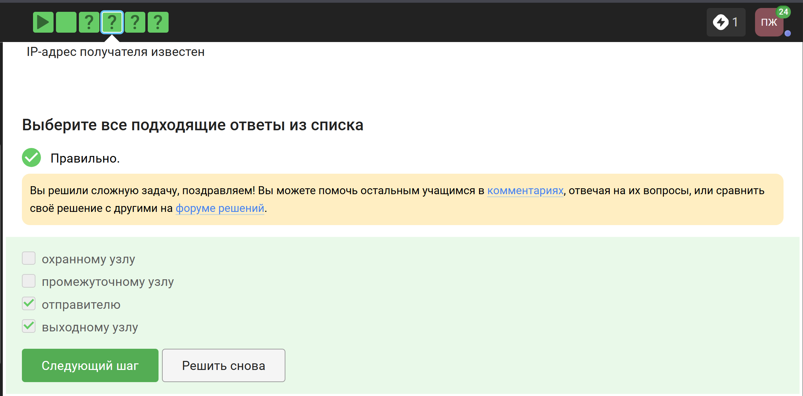{#fig-015 width=70%}

Отправитель генерирует общий секретный ключ с узлами, через которые идёт передача, то есть, со всеми перечисленными ([рис. @fig-016]). 

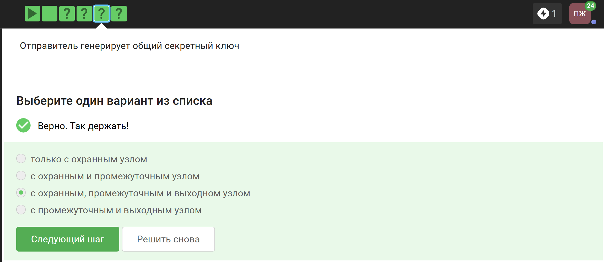{#fig-016 width=70%}

Для получения пакетов не нужно использовать TOR. TOR - это технология, которая позволяет с некоторым успехом скрыть личность человека в интернете ([рис. @fig-017]). 

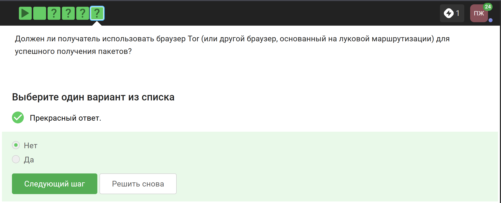{#fig-017 width=70%}

## Беспроводные сети Wi-Fi

Выбранное определенние наиболее точно ([рис. @fig-018]). 

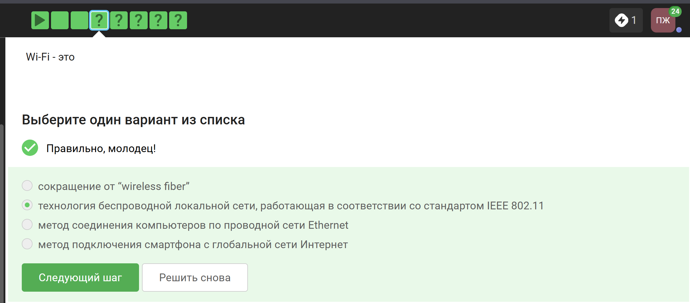{#fig-018 width=70%}

Для целей работы в Интернете Wi-Fi обычно располагается как канальный уровень (эквивалентный физическому и канальному уровням модели OSI) ниже интернет-уровня интернет-протокола. Это означает, что узлы имеют связанный интернет-адрес, и при подходящем подключении это обеспечивает полный доступ в Интернет ([рис. @fig-019]). 

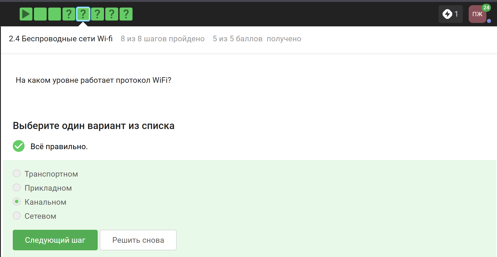{#fig-019 width=70%}

WEP (Wired Equivalent Privacy) - устаревший и небезопасный метод проверки подлинности. Это первый и  не очень удачный метод защиты. Злоумышленники без проблем получают доступ к беспроводным сетям, которые защищены с помощью WEP, он был заменён остальными представленными ([рис. @fig-020]). 

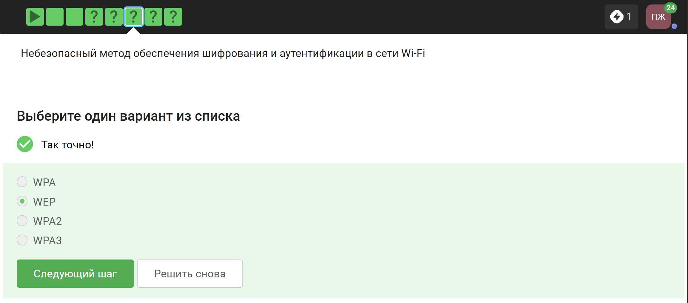{#fig-020 width=70%}

Нужно аутентифицировать устройства и позже передаются зашифрованные данные ([рис. @fig-021]). 

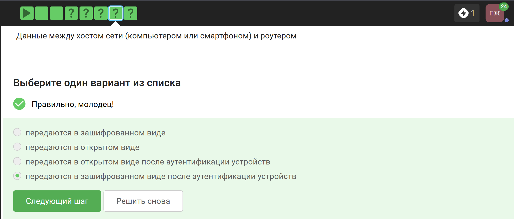{#fig-021 width=70%}

WPA2 Personal предназначен для личного использования, то есть, для домашней сети, Enterprise - для предприятий ([рис. @fig-022]). 

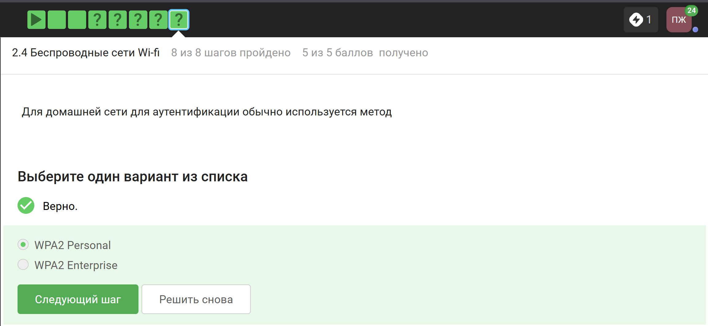{#fig-022 width=70%}

# Выводы

В ходе выполнения блока "Безопасность в сети" я узнала о работе базовых сетевых протоколов, куки сетей Wi-Fi и браузера TOR.

# Список литературы{.unnumbered}

::: {#refs}
:::
