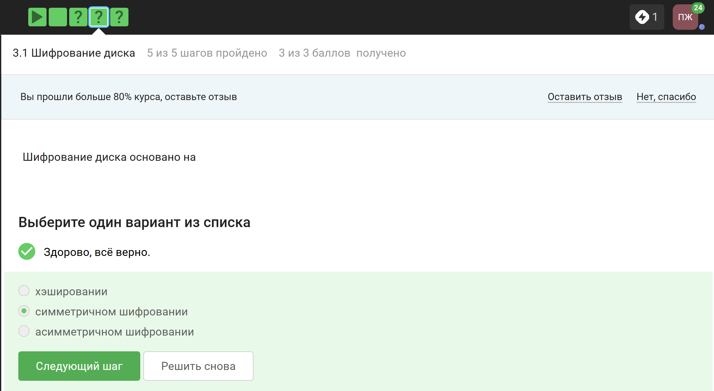
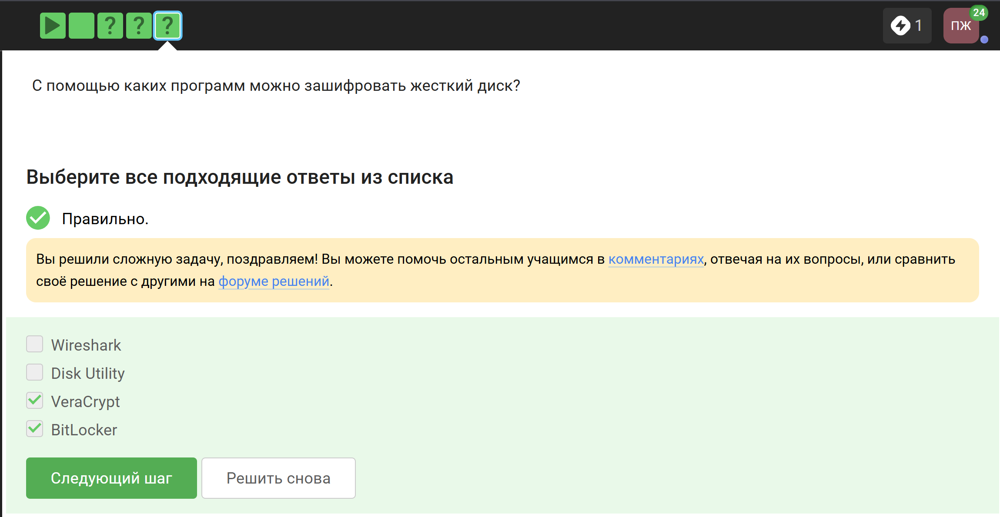
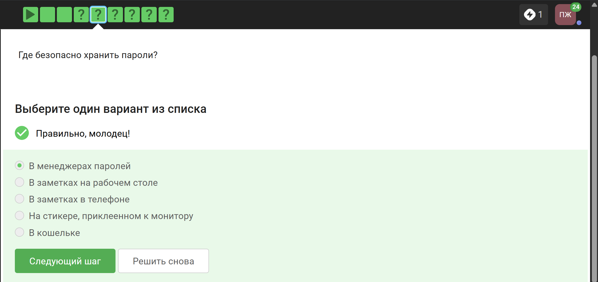
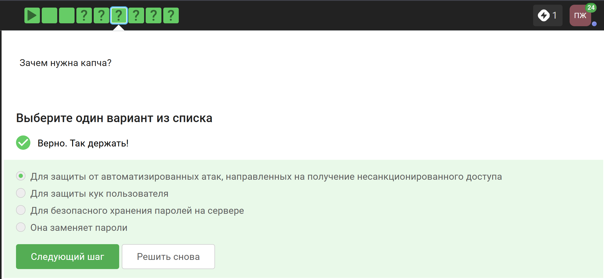
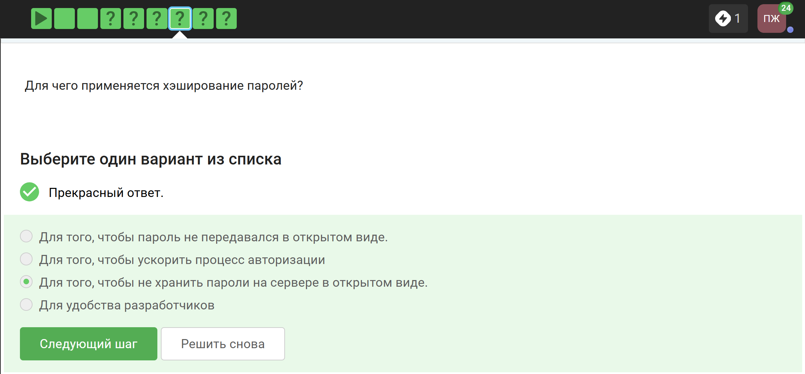
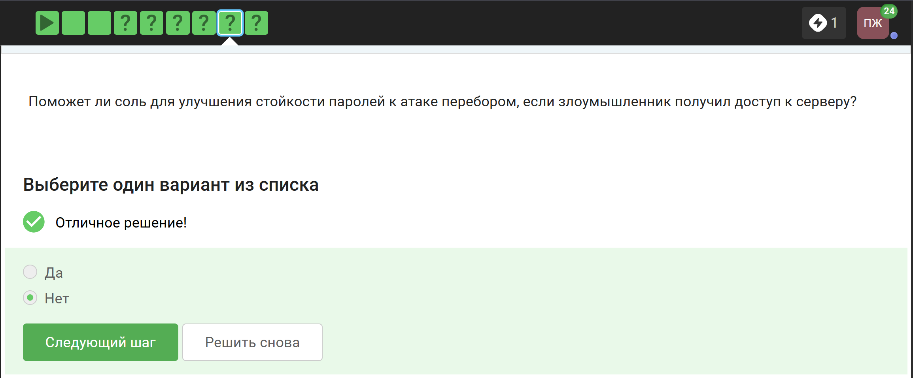
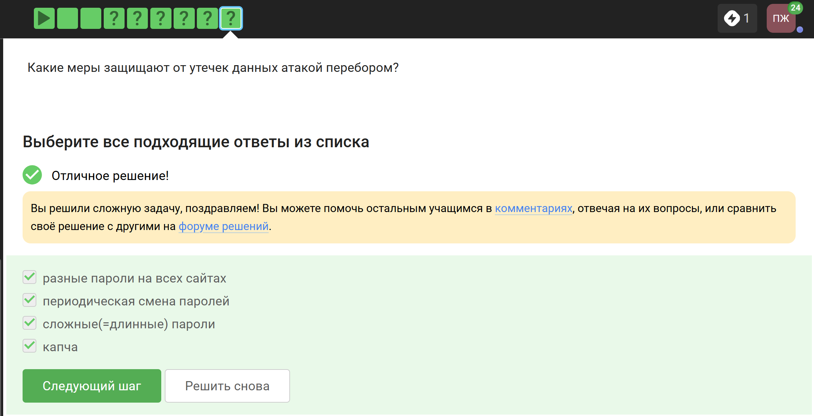
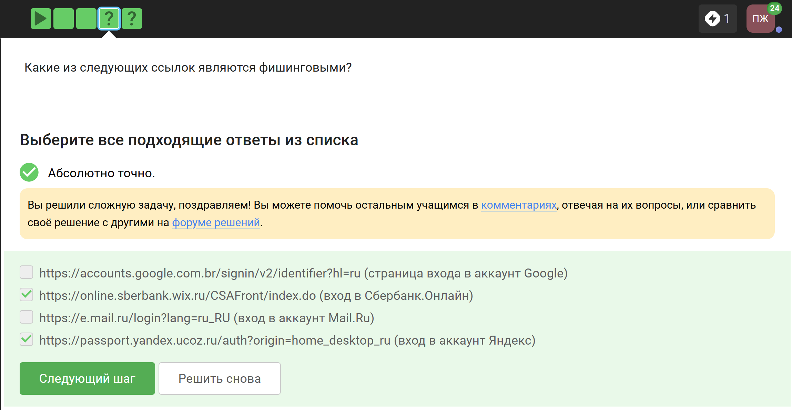
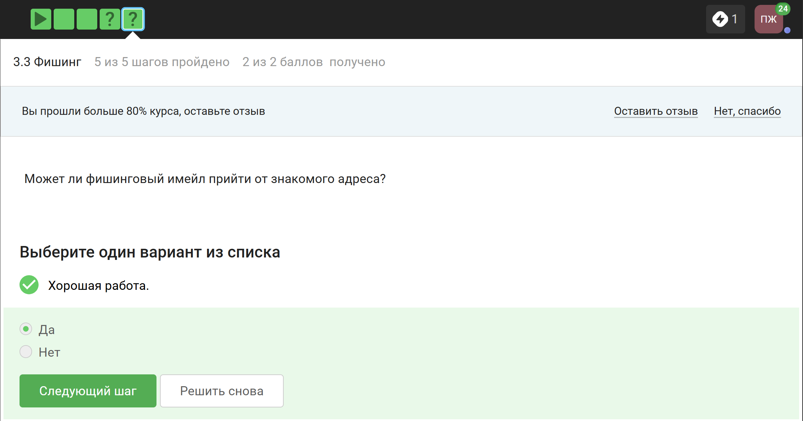
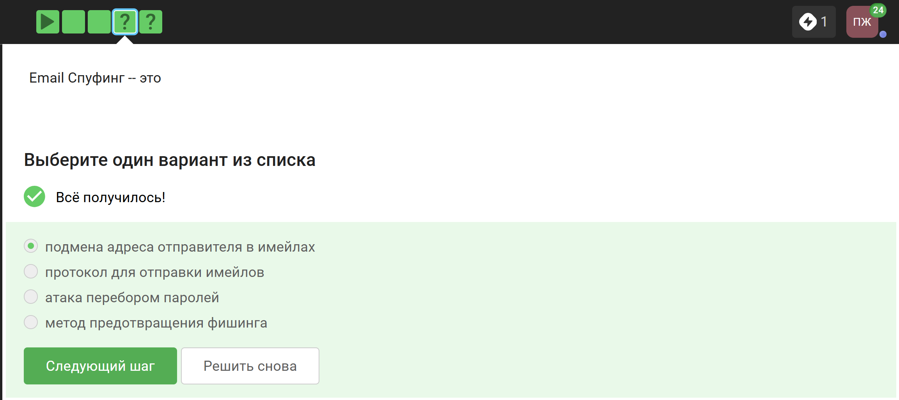

---
## Author
author:
  name: Панина Жанна Валерьевна
  degrees: бакалавр
  orcid: 
  email: 1132246710@rudn.ru
  affiliation:
    - name: Российский университет дружбы народов
      country: Российская Федерация
      postal-code: 
      city: Москва
      address: ул. Миклухо-Маклая, д. 6
## Title
title: Индивидуальный проект
subtitle: 2 Этап
license: CC BY
date: today
date-format: "2026-03-21" 
---

# Информация

## Докладчик

:::::::::::::: {.columns align=center}
::: {.column width="70%"}

  Панина Жанна Валерьевна
  студентка НКАбд-02-24
  Российский университет дружбы народов им. П. Лумумбы
  [1132246710@rudn.ru](mailto:1132246710@rudn.ru)
  <https://github.com/zvpanina/study_2025-2026_infosec-intro>

:::
::::::::::::::

# Вводная часть

# Цель работы

Приобретение практических навыков по установке  DVWA

# Задание

Установить дистрибутив DVWA в Kali Linux

# Теоретическое введение

DVWA - это уязвимое веб-приложение, разработанное на PHP и MYSQL.

Некоторые из уязвимостей веб приложений, который содержит DVWA:
- Брутфорс: Брутфорс HTTP формы страницы входа - используется для тестирования инструментов по атаке на пароль методом грубой силы и показывает небезопасность слабых паролей.
- Исполнение (внедрение) команд: Выполнение команд уровня операционной системы.
- Межсайтовая подделка запроса (CSRF): Позволяет «атакующему» изменить пароль администратора приложений.
- Внедрение (инклуд) файлов: Позволяет «атакующему» присоединить удалённые/локальные файлы в веб приложение.
- SQL внедрение: Позволяет «атакующему» внедрить SQL выражения в HTTP из поля ввода, DVWA включает слепое и основанное на ошибке SQL внедрение.
- Небезопасная выгрузка файлов: Позволяет «атакующему» выгрузить вредоносные файлы на веб сервер.
- Межсайтовый скриптинг (XSS): «Атакующий» может внедрить свои скрипты в веб приложение/базу данных. DVWA включает отражённую и хранимую XSS.
- Пасхальные яйца: раскрытие полных путей, обход аутентификации и некоторые другие.

##

DVWA имеет четыре уровня безопасности, они меняют уровень безопасности каждого веб приложения в DVWA:
- Невозможный — этот уровень должен быть безопасным от всех уязвимостей. Он используется для сравнения уязвимого исходного кода с безопасным исходным кодом.
- Высокий — это расширение среднего уровня сложности, со смесью более сложных или альтернативных плохих практик в попытке обезопасить код. Уязвимости не позволяют такой простор эксплуатации как на других уровнях.
- Средний — этот уровень безопасности предназначен главным образом для того, чтобы дать пользователю пример плохих практик безопасности, где разработчик попытался сделать приложение безопасным, но потерпел неудачу.
- Низкий — этот уровень безопасности совершенно уязвим и совсем не имеет защиты. Его предназначение быть примером среди уязвимых веб приложений, примером плохих практик программирования и служить платформой обучения базовым техникам эксплуатации. [@guide, @parasram]

# Выполнение лабораторной работы

Перехожу в директорию `/var/www/html`. Затем клонирую нужный репозиторий GitHub ([рис. @fig-001]).

{#fig:001 width=70%}

##

Чтобы настроить DVWA, нужно перейти в каталог `/dvwa/config`, затем проверяю содержимое каталога ([рис. @fig-002]).

{#fig:002 width=70%}

Изменяю файл, используемый для настройки DVWA `config.inc.php.dist` на `config.inc.php`. 

##

Далее открываю файл в текстовом редакторе nano ([рис. @fig-003]). Изменяю данные об имени пользователя и пароле.

{#fig:003 width=70%}

##

По умолчанию в Kali Linux установлен mysql, поэтому можно его запустить без предварительного скачивания, далее выполняю проверку, запущен ли процесс ([рис. @fig-004]).

{#fig:004 width=70%}

##

Авторизируюсь в базе данных от имени пользователя root ([рис. @fig-005]). Появляется командная строка с приглашением "MariaDB".
Далее создаем в ней нового пользователя, используя учетные данные из файла config.inc.php. Теперь нужно пользователю предоставить привилегии для работы с этой базой данных.

{#fig:005 width=70%}

##

Необходимо настроить сервер apache2, перехожу в соответствующую директорию ([рис. @fig-006]). В файле `php.ini` нужно будет изменить один параметр, поэтому открываю файл в текстовом редакторе.

{#fig:006 width=70%}

##

В файле параметры allow_url_fopen и allow_url_include должны быть поставлены как `On` ([рис. @fig-007]).

{#fig:007 width=70%}

##

Запускаем службу веб-сервера apache и проверяем, запущена ли служба ([рис. @fig-008]).

{#fig:008 width=70%}

##

Мы настроили DVWA, Apache и базу данных, поэтому открываем браузер и запускаем веб-приложение, введя 127.0.0/DVWA ([рис. @fig-009]).

{#fig:009 width=70%}

##

Прокручиваем страницу вниз и нажимем на кнопку `create\reset database` ([рис. @fig-010]).

{#fig:010 width=70%}

##

Авторизуюсь с помощью предложенных по умолчанию данных ([рис. @fig-011]).

{#fig:011 width=70%}

##

Оказываюсь на домашней странице веб-приложения, на этом установка окончена ([рис. @fig-012]).

{#fig:012 width=70%}

# Результаты

В ходе работы я приобрела практические навыки по установке уязвимого веб-приложения DVWA.

:::
