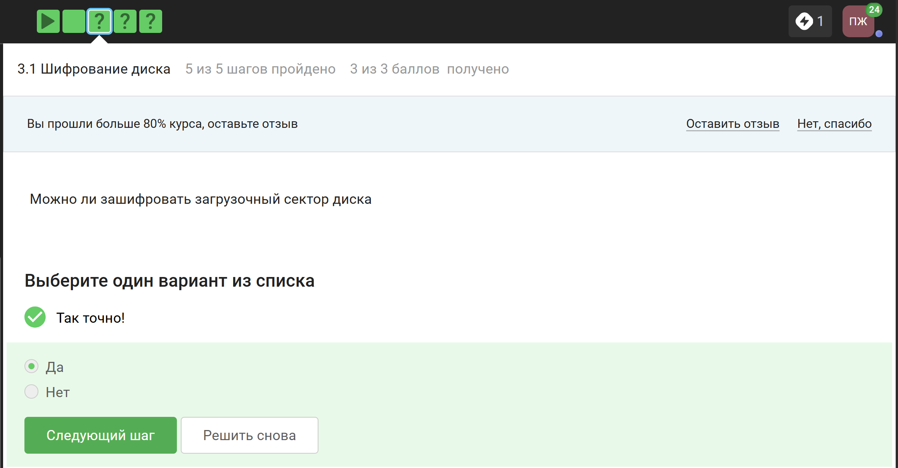
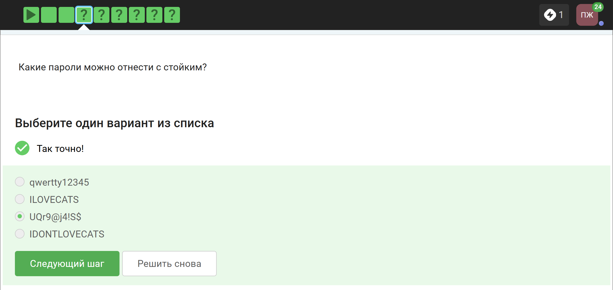
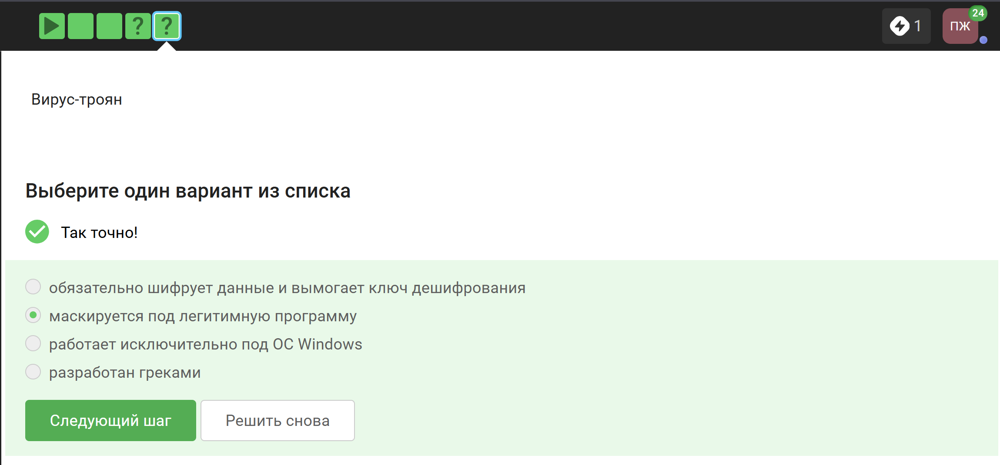
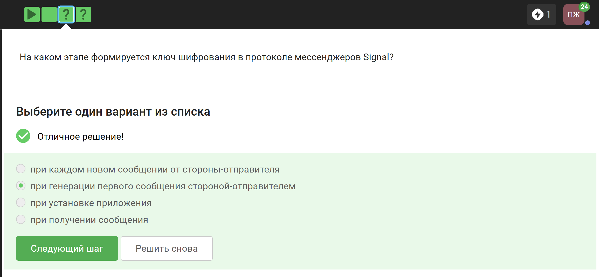
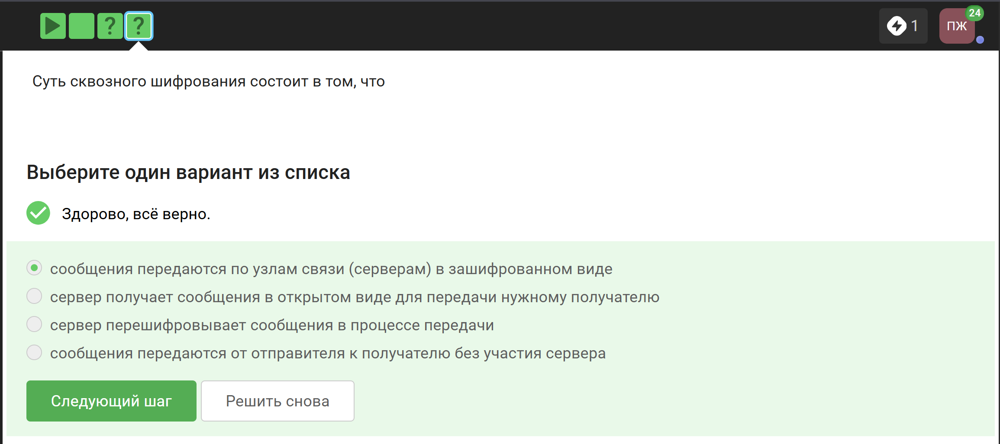

---
## Author
author:
  name: Панина Жанна Валерьевна
  degrees: bachelor
  orcid: 
  email: 1132246710@rudn.ru
  affiliation:
    - name: Российский университет дружбы народов
      country: Российская Федерация
      postal-code: 
      city: Москва
      address: ул. Миклухо-Маклая, д. 6

## Title
title: "Внешний курс. Блок 2: Защита ПК/телефона"
subtitle: "Основы информационной безопасности"
license: "CC BY"
---

# Цель работы

Выполнение контрольных заданий второго блока внешнего курса "Основы кибербезопасности". В ходе выполнения контрольных заданий использовались материалы курса [@stepik_infosec].

# Выполнение заданий 2 блока

## Шифрование диска

Шифрование диска - технология защиты информации, переводящая данные на диске в нечитаемый код, который нелегальный пользователь не сможет легко расшифровать. Соответственно, можно ([рис. @fig-001]).

{#fig-001 width=70%}

Ответ представлен на изображении ([рис. @fig-002]).

{#fig-002 width=70%}

Отмечены программы, с помощью которых можно зашифровать жёсткий диск ([рис. @fig-003]). 

{#fig-003 width=70%}

## Пароли

Стойкий пароль должен содержать строчные и заглавные буквы, цифры, а также специальные символы - и желательно это несвязный набор знаков, и точно не имя питомца или дата своего рождения ([рис. @fig-004]).

{#fig-004 width=70%}

Все варианты кроме менеджера паролей совершенно ненадёжные ([рис. @fig-005]). 

{#fig-005 width=70%}

Капча нужна для проверки того, что за экраном не робот, а человек ([рис. @fig-006]). 

{#fig-006 width=70%}

Пароли опасно хранить в открытом виде, поэтому их хранят хэши ([рис. @fig-007]).

{#fig-007 width=70%}

Вряд ли соль поможет ([рис. @fig-008]).

{#fig-008 width=70%}

Все представленные меры защищают от утечек данных ([рис. @fig-009]).

{#fig-009 width=70%}

Фишинговые ссылки похожи на "оригинальные" ссылки хорошо знакомых нам сервисов, но с некоторыми отличиями ([рис. @fig-010]).

{#fig-010 width=70%}

Да, может, например, если нашего знакомого взломали ([рис. @fig-011]).

{#fig-011 width=70%}

## Вирусы. Примеры

Данное определение точно описывает понятие имейл спуфинг ([рис. @fig-012]).

{#fig-012 width=70%}

Вирусы-трояны, которые неопытный пользователь может установить по ошибке, маскируются под легитимные и полезные программы ([рис. @fig-013]).

{#fig-013 width=70%}

## Безопаность мессенджеров

При генерации первого сообщения отправителем формируется ключ шифрования ([рис. @fig-014]).

{#fig-014 width=70%}

Дан исчерпывающий ответ ([рис. @fig-015]).

{#fig-015 width=70%}

# Выводы

Был пройден второй блок курса, изучены правила хранения паролей и основная информация о вирусах.

# Список литературы{.unnumbered}

::: {#refs}
:::
