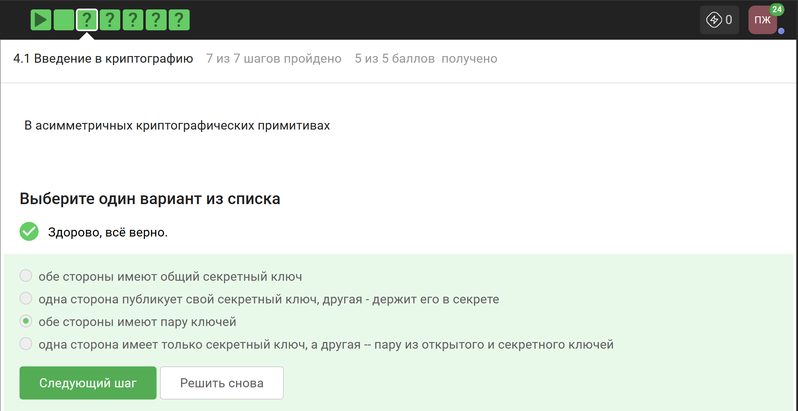
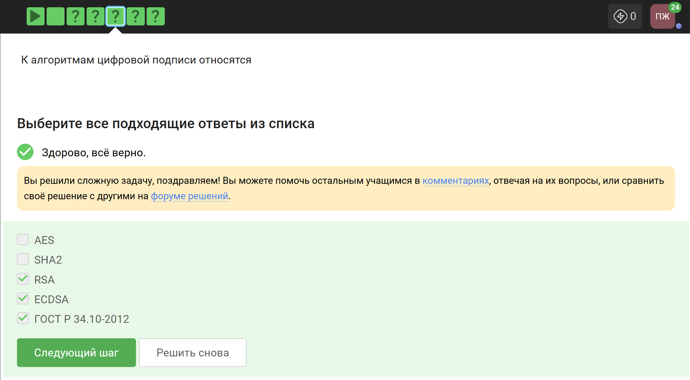
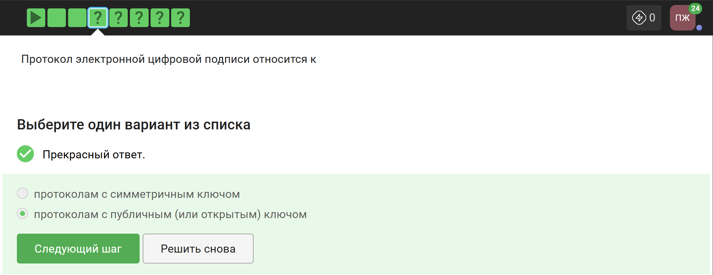
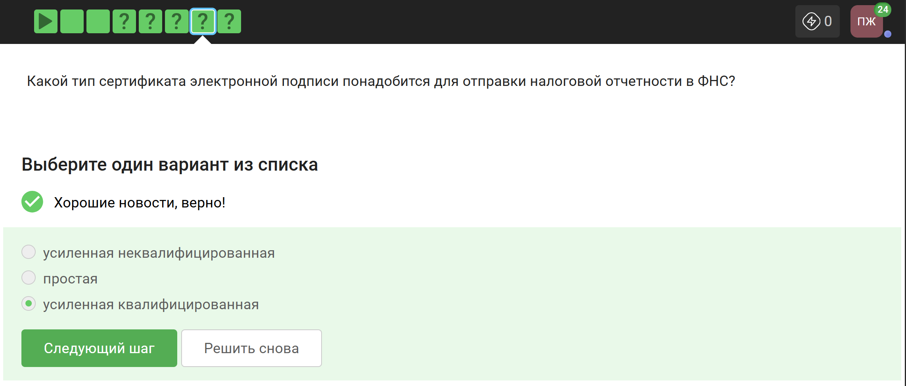
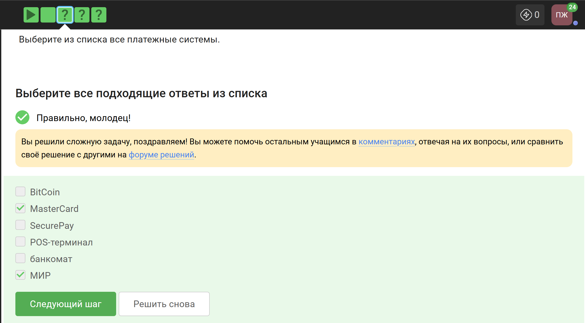
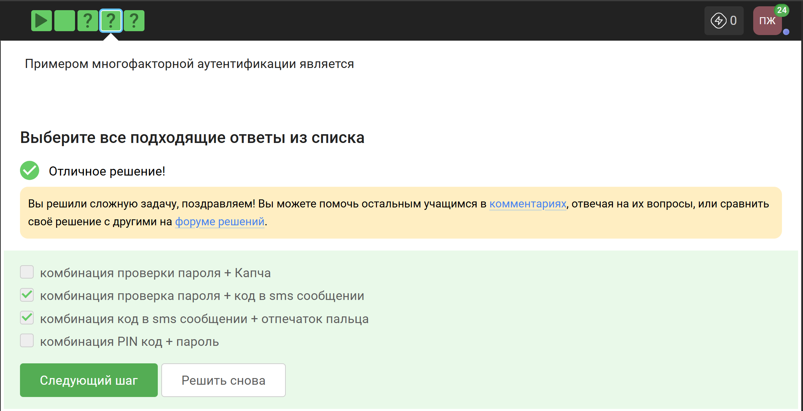
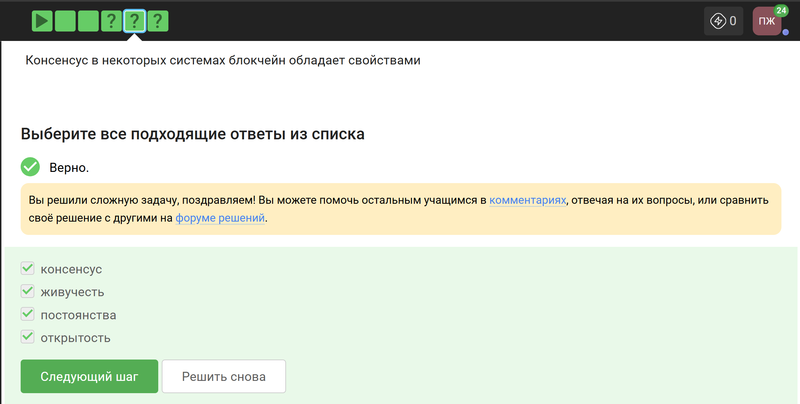
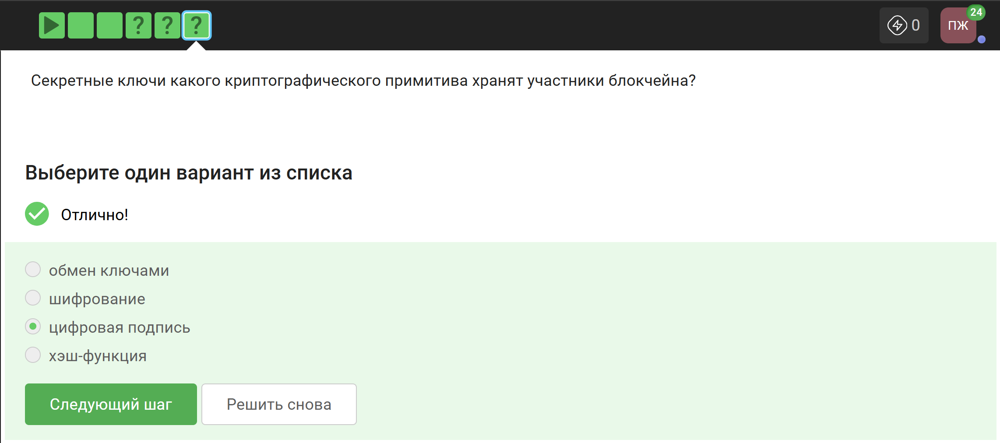
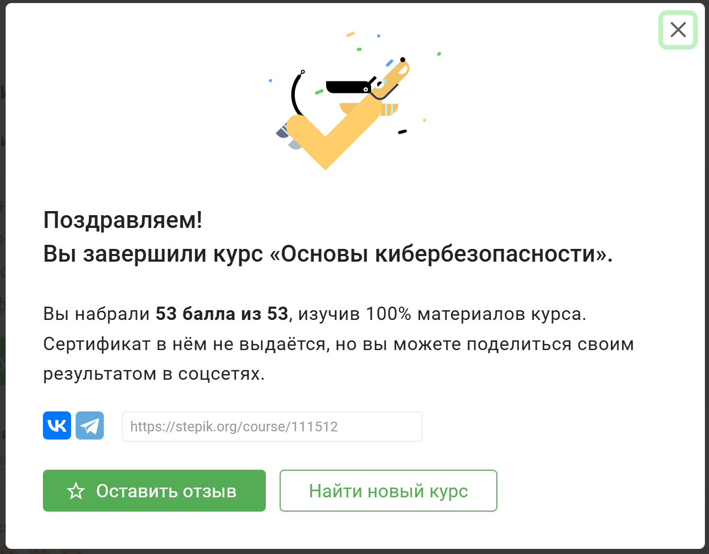

---
## Author
author:
  name: Панина Жанна Валерьевна
  degrees: бакалавр
  orcid: 
  email: 1132246710@rudn.ru
  affiliation:
    - name: Российский университет дружбы народов
      country: Российская Федерация
      postal-code: 
      city: Москва
      address: ул. Миклухо-Маклая, д. 6
## Title
title: Внешний курс. Блок 3 - Криптография на практике
subtitle: Основы информационной безопасности
license: CC BY
date: today
date-format: "2026-05-16" # Example: 2025-09-06
---

# Информация

## Докладчик

:::::::::::::: {.columns align=center}
::: {.column width="70%"}

  * Панина Жанна Валерьевна
  * студентка НКАбд-02-24
  * Российский университет дружбы народов им. П. Лумумбы
  * [1132246710@rudn.ru](mailto:1132246710@rudn.ru)
  * <https://github.com/zvpanina/study_2025-2026_infosec-intro>
  * Преподаватель: Кулябов Дмитрий Сергеевич, профессор кафедры теории вероятностей и кибербезопасности

:::
::: {.column width="30%"}

:::
::::::::::::::

# Вводная часть

## Актуальность

- Широкое применение криптографии
- Необходимость защиты цифровых данных
- Использование электронной подписи и шифрования

## Объект и предмет исследования

### Объект исследования:

Криптографические системы защиты информации

### Предмет исследования:

Алгоритмы шифрования, цифровая подпись и криптографические протоколы

## Цели и задачи

Цель - изучение практического применения криптографических механизмов

Задачи:

- изучить симметричную криптографию;
- рассмотреть электронную подпись;
- исследовать хэш-функции;
- изучить криптографические механизмы блокчейна

## Материалы и методы

Материалы:

- курс Stepik;
- криптографические алгоритмы;
- тестовые задания

Методы:

- анализ криптографических примитивов;
- изучение практических сценариев применения;
- сравнение алгоритмов

# Основная часть - Выполнение заданий 3 блока

## Введение в криптографию

Для ответа на вопрос используется определение ассиметричного шифрования с двумя ключами.

{#fig-001 width=70%}

##

Отмечены основные условия для криптографической хэш-функции.

{#fig-002 width=70%}

##

Отмечены алгоритмы цифровой подписи.

{#fig-003 width=70%}

##

В информационной безопасности аутентификация сообщения или аутентификация источника данных - это свойство, которое гарантирует, что сообщение не было изменено во время передачи (целостность данных), и что принимающая сторона может проверить источник сообщения .

{#fig-004 width=70%}

##

Верно дано определение обмена ключами Диффи-Хэллмана.

{#fig-005 width=70%}

## Цифровая подпись

По определению цифровой подписи протокол ЭЦП относится к протоколам с публичным ключом.

{#fig-006 width=70%}

##

На первом этапе получатель сообщения строит собственный вариант хэш-функции подписанного документа. На втором этапе происходит расшифровка хэш-функции, содержащейся в ообщении, с помощью открытого ключа отправителя. На третьем этапе производится сравнение двух хэш-функций. Их совпадение гарантирует одновременно подлинность содержимого документа и его авторства.

{#fig-007 width=70%}

##

Электронная подпись обеспечивает всё указанное, кроме конфиденциальности.

{#fig-008 width=70%}

##

Для отправки налоговой отчётности в ФНС используется усиленная квалифицированная электронная подпись.

{#fig-009 width=70%}

##

Верный ответ указан на изображении.

{#fig-010 width=70%}

## Электронные платежи

Известные платёжные системы - Visa, MasterCard, МИР.

{#fig-011 width=70%}

##

Верные варианты на изображении.

{#fig-012 width=70%}

##

При онлайн-платежах используется многофакторная аутентификация.

{#fig-013 width=70%}

## Блокчейн

Proof-of-Work (PoW, доказательство выполнения работы) - это алгоритм достижения консенсуса в блокчейне. Он используется для подтверждения транзанкций и создания новых блоков. С помощью PoW майнеры конкурируют друг с другом за завершение транзакций в сети и за вознаграждение. Пользователи сети отправляют друг другу цифровые токены, после чего все транзакции собираются в блоки и записываются в распределённый реестр, то есть, в блокчейн.

{#fig-014 width=70%}

##

Консенсус блокчейна - это процедура, в ходе которой участники сети достигают согласия о текущем состоянии данных в сети. Благодаря этому алгоритмы консенсуса устанавливают надёжность и доверие к самой сети.

{#fig-015 width=70%}

##

Ответ - цифровая подпись.

{#fig-016 width=70%}

##

Все задания курса выполнены, мне пришла информация о прохождении, но сертификат не выдаётся.

{#fig-017 width=70%}

# Анализ и практическая значимость

- Изучены современные криптографические механизмы 
- Рассмотрены ЭЦП, хэш-функции и асимметричное шифрование
- Проанализировано применение криптографии в блокчейне
- Показано практическое значение криптографической защиты
