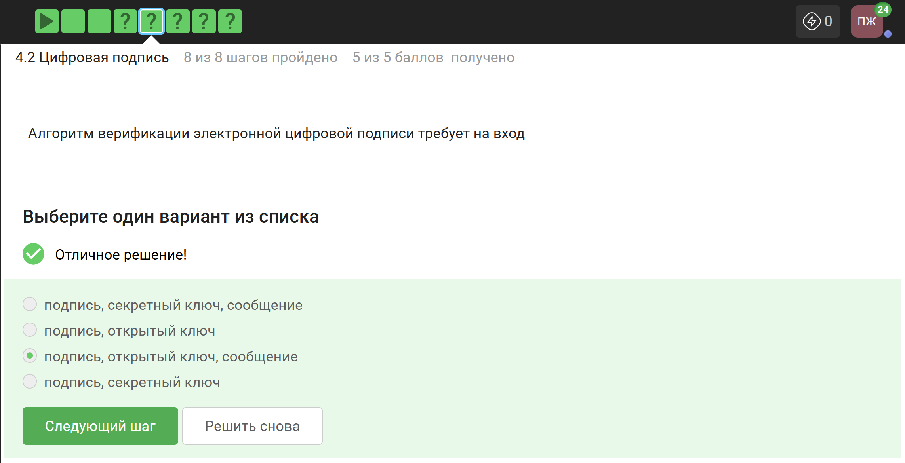
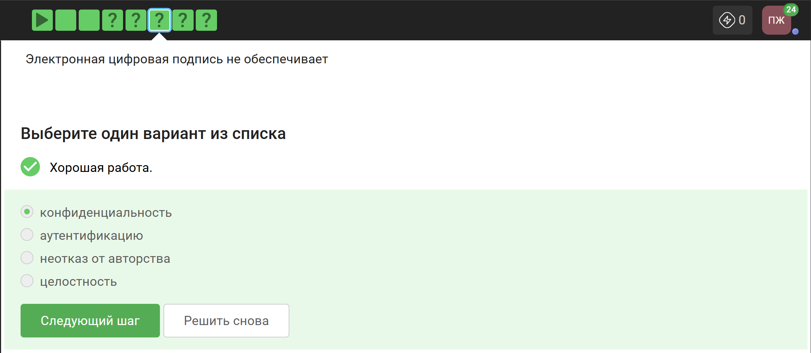
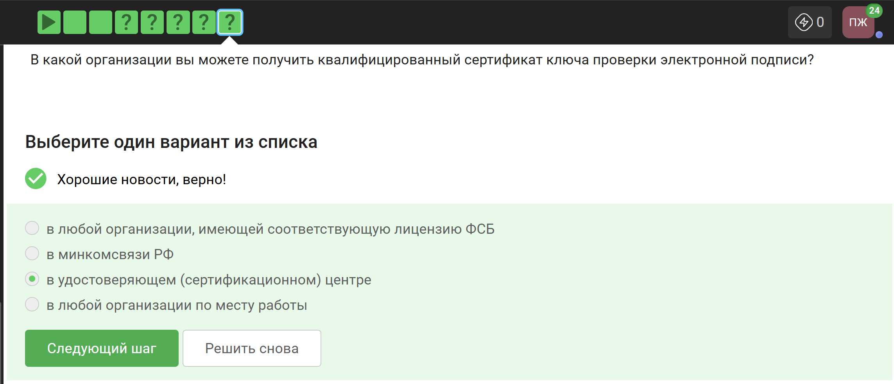
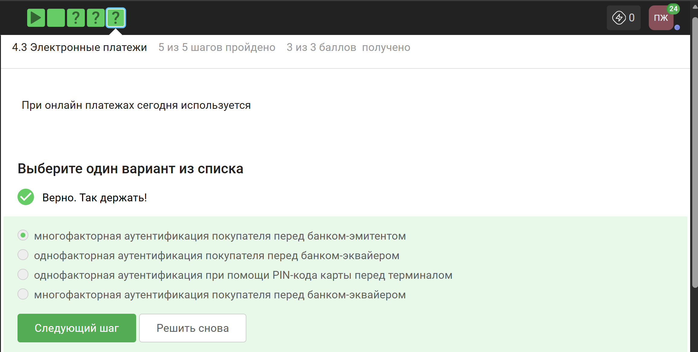
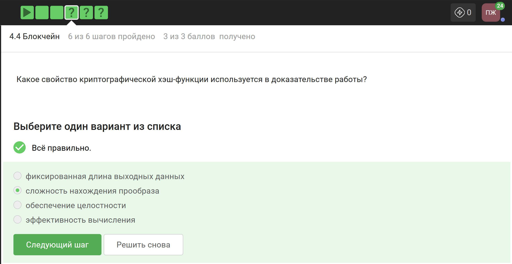

---
## Author
author:
  name: Панина Жанна Валерьевна
  degrees: bachelor
  orcid: 
  email: 1132246710@rudn.ru
  affiliation:
    - name: Российский университет дружбы народов
      country: Российская Федерация
      postal-code: 
      city: Москва
      address: ул. Миклухо-Маклая, д. 6

## Title
title: "Внешний курс. Блок 3: Криптография на практике"
subtitle: "Основы информационной безопасности"
license: "CC BY"
---

# Цель работы

Выполнение контрольных заданий третьего блока внешнего курса "Основы кибербезопасности". В ходе выполнения контрольных заданий использовались материалы курса [@stepik_infosec].

# Выполнение заданий 3 блока

## Введение в криптографию

Для ответа на вопрос используется определение ассиметричного шифрования с двумя ключами ([рис. @fig-001]).

{#fig-001 width=70%}

Отмечены основные условия для криптографической хэш-функции ([рис. @fig-002]).

{#fig-002 width=70%}

Отмечены алгоритмы цифровой подписи ([рис. @fig-003]).

{#fig-003 width=70%}

В информационной безопасности аутентификация сообщения или аутентификация источника данных - это свойство, которое гарантирует, что сообщение не было изменено во время передачи (целостность данных), и что принимающая сторона может проверить источник сообщения ([рис. @fig-004]).

{#fig-004 width=70%}

Верно дано определение обмена ключами Диффи-Хэллмана ([рис. @fig-005]).

{#fig-005 width=70%}

## Цифровая подпись

По определению цифровой подписи протокол ЭЦП относится к протоколам с публичным ключом ([рис. @fig-006]).

{#fig-006 width=70%}

Алгоритм верификации электронной подписи состоит в следующем: на первом этапе получатель сообщения строит собственный вариант хэш-функции подписанного документа. На втором этапе происходит расшифровка хэш-функции, содержащейся в ообщении, с помощью открытого ключа отправителя. На третьем этапе производится сравнение двух хэш-функций. Их совпадение гарантирует одновременно подлинность содержимого документа и его авторства ([рис. @fig-007]).

{#fig-007 width=70%}

Электронная подпись обеспечивает всё указанное, кроме конфиденциальности ([рис. @fig-008]).

{#fig-008 width=70%}

Для отправки налоговой отчётности в ФНС используется усиленная квалифицированная электронная подпись ([рис. @fig-009]).

{#fig-009 width=70%}

Верный ответ указан на изображении ([рис. @fig-010]).

{#fig-010 width=70%}

## Электронные платежи

Известные платёжные системы - Visa, MasterCard, МИР ([рис. @fig-011]).

{#fig-011 width=70%}

Верные варианты на изображении ([рис. @fig-012]).

{#fig-012 width=70%}

При онлайн-платежах используется многофакторная аутентификация ([рис. @fig-013]).

{#fig-013 width=70%}

## Блокчейн

Proof-of-Work (PoW, доказательство выполнения работы) - это алгоритм достижения консенсуса в блокчейне. Он используется для подтверждения транзанкций и создания новых блоков. С помощью PoW майнеры конкурируют друг с другом за завершение транзакций в сети и за вознаграждение. Пользователи сети отправляют друг другу цифровые токены, после чего все транзакции собираются в блоки и записываются в распределённый реестр, то есть, в блокчейн ([рис. @fig-014]).

{#fig-014 width=70%}

Консенсус блокчейна - это процедура, в ходе которой участники сети достигают согласия о текущем состоянии данных в сети. Благодаря этому алгоритмы консенсуса устанавливают надёжность и доверие к самой сети ([рис. @fig-015]).

{#fig-015 width=70%}

Ответ - цифровая подпись ([рис. @fig-016]).

{#fig-016 width=70%}

Все задания курса выполнены, мне пришла информация о прохождении, но сертификат не выдаётся ([рис. @fig-017]).

{#fig-017 width=70%}

# Выводы

Был пройден третий, завершающий блок курса и изучены его основные понятия.

# Список литературы{.unnumbered}

::: {#refs}
