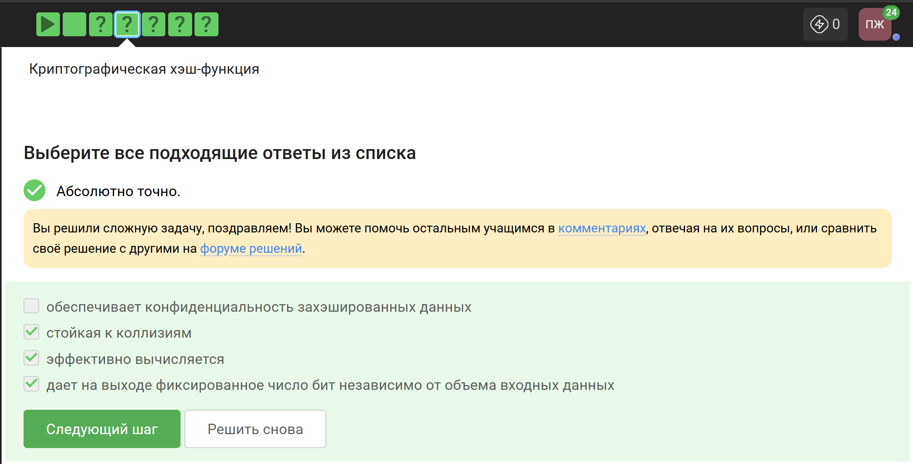
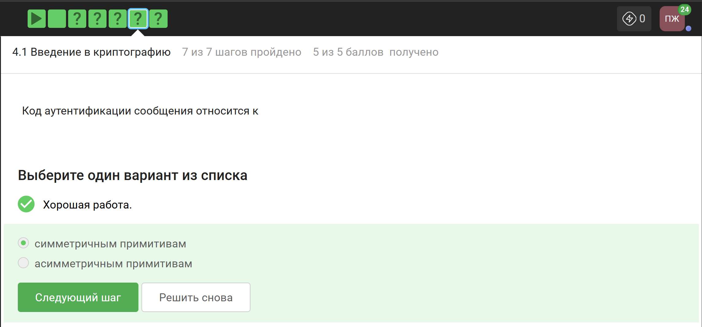
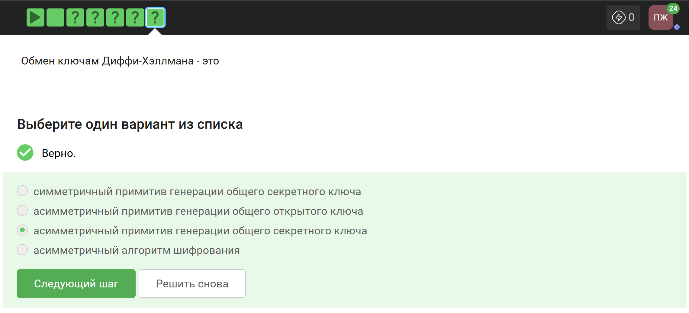

---
## Author
author:
  name: Панина Жанна Валерьевна
  degrees: bachelor
  orcid: 
  email: 1132246710@rudn.ru
  affiliation:
    - name: Российский университет дружбы народов
      country: Российская Федерация
      postal-code: 
      city: Москва
      address: ул. Миклухо-Маклая, д. 6

## Title
title: "Индивидуальный проект"
subtitle: "3 Этап"
license: "CC BY"
---

# Цель работы

Приобретение практических навыков по использованию инструмента Hydra для брутфорса паролей.

# Задание

Реализовать эксплуатацию уязвимости с помощью брутфорса паролей.

# Теоретическое введение

- Hydra используется для подбора или взлома имени пользователя и пароля.
- Поддерживает подбор для большого набора приложений [@brute, @force, @parasram].

Пример работы:

Исходные данные:
IP сервера 178.72.90.181; Сервис http на стандартном 80 порту;

Для авторизации используется html форма, которая отправляет по адресу http://178.72.90.181/cgi-bin/luci методом POST запрос вида username=root&password=test_password;
В случае неудачной аутентификации пользователь наблюдает сообщение Invalid username and/or password! Please try again.
Запрос к Hydra будет выглядеть примерно так:

```hydra -l root -P ~/pass_lists/dedik_passes.txt -o ./hydra_result.log -f -V -s 80 178.72.90.181 http-post-form "/cgi-bin/luci:username=^USER^&password=^PASS^:Invalid username"```

Используется http-post-form потому, что авторизация происходит по http методом post.
После указания этого модуля идёт строка /cgi-bin/luci:username=^USER^&password=^PASS^:Invalid username, у которой через двоеточие (:) указывается:

- путь до скрипта, который обрабатывает процесс аутентификации (/cgi-bin/luci);
- строка, которая передаётся методом POST, в которой логин и пароль заменены на ^USER^ и ^PASS^ соответственно (username=^USER^&password=^PASS^);
- строка, которая присутствует на странице при неудачной аутентификации; при её отсутствии Hydra поймёт, что мы успешно вошли (Invalid username).

# Выполнение лабораторной работы

1. Чтобы пробрутфорсить пароль, нужно найти список частоиспользуемых паролей, например, я нашла в открытом источнике - стандартный список паролей для kali ```rockyou.txt``` ([рис. @fig-001]).

{#fig-001 width=70%}

2. Захожу на сайт DVWA, предварительно запустив  в терминале apache2 и mysql ([рис. @fig-002]).

{#fig-002 width=70%}

3. Для запроса hydra нужны парамеры cookie с этого сайта. Для получения информации о файлах cookie нажимаю F12 и открываю вкладку 'Storage' и копирую ```PHPSESSID``` и ```security``` ([рис. @fig-003]).

{#fig-003 width=70%}

4. Ввожу соответствующий запрос в Hydra. Подбираю пароль для пользователя admin, использую GET-запрос с двумя параметрами: безопасность и PHPSESSID ([рис. @fig-004]). Через некоторое время появляется результат с подходящими паролями.

{#fig-004 width=70%}

5. Ввожу полученные данные на сайт для проверки ([рис. @fig-005]).

{#fig-005 width=70%}

6. Получаем результат- всё получилось, мы вошли ([рис. @fig-006]).

{#fig-006 width=70%}

# Выводы

В ходе выполнения работы я приобрела практические навыки по использованию инструмента Hydra для брутфорса паролей.

# Список литературы{.unnumbered}

::: {#refs}
