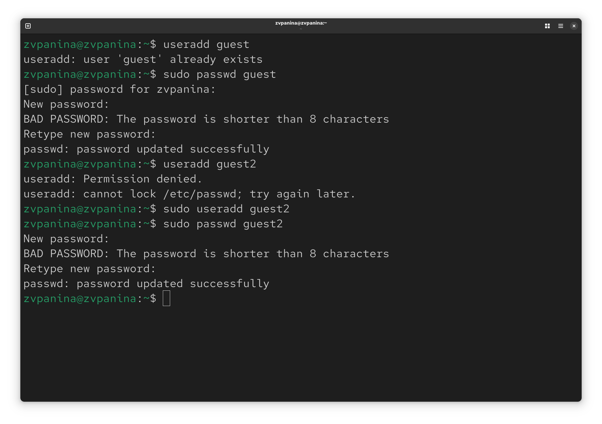
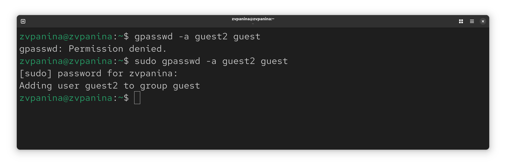
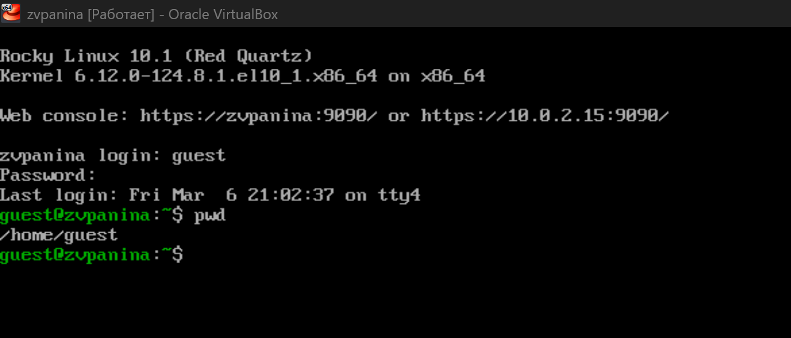
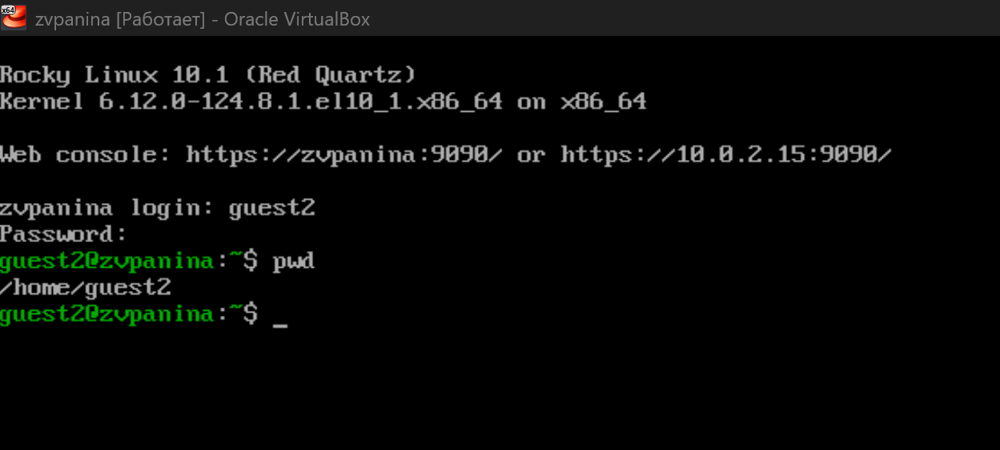
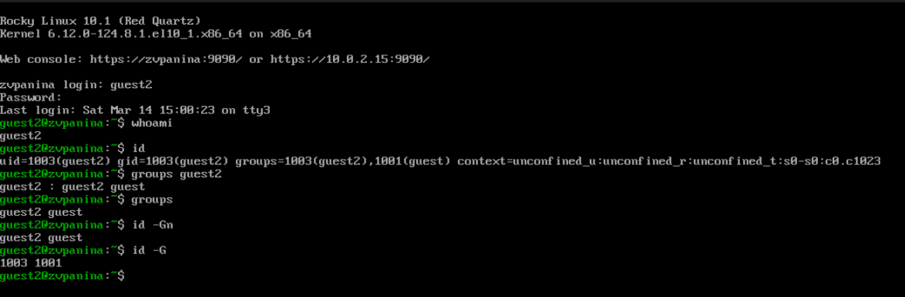
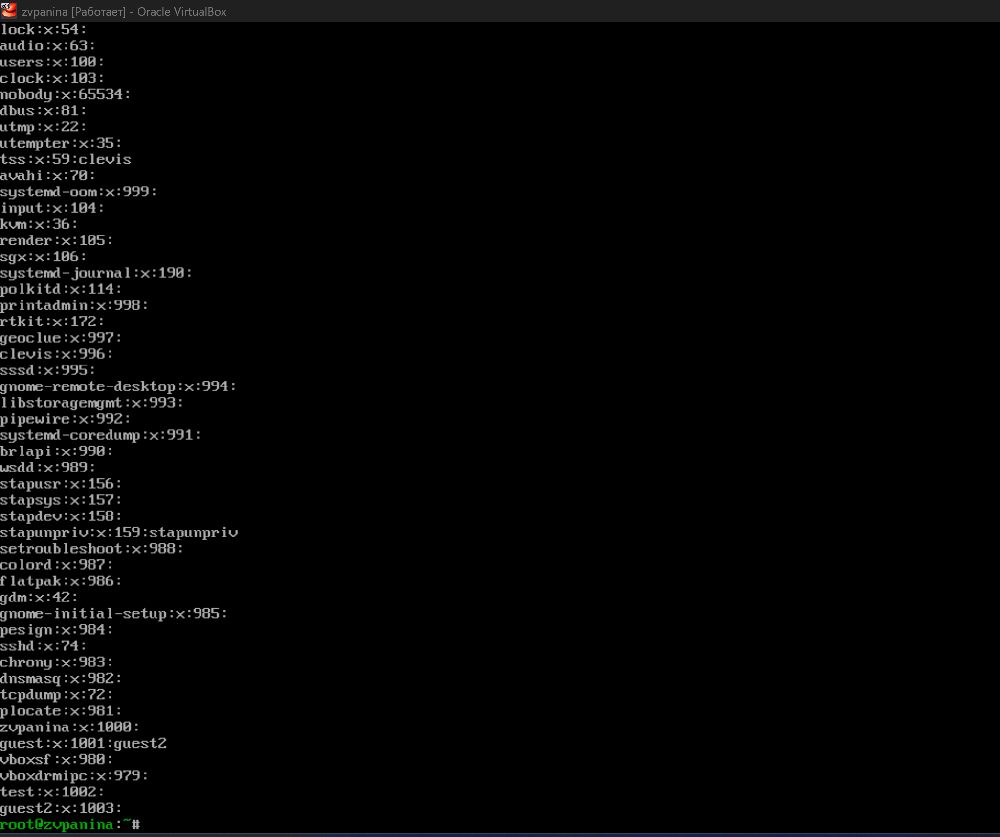
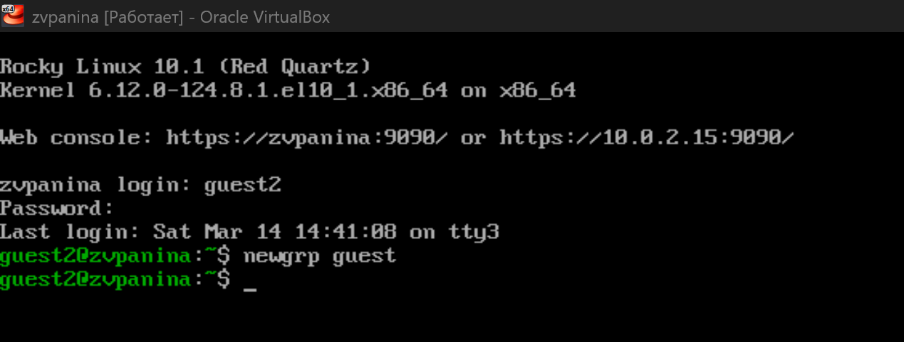
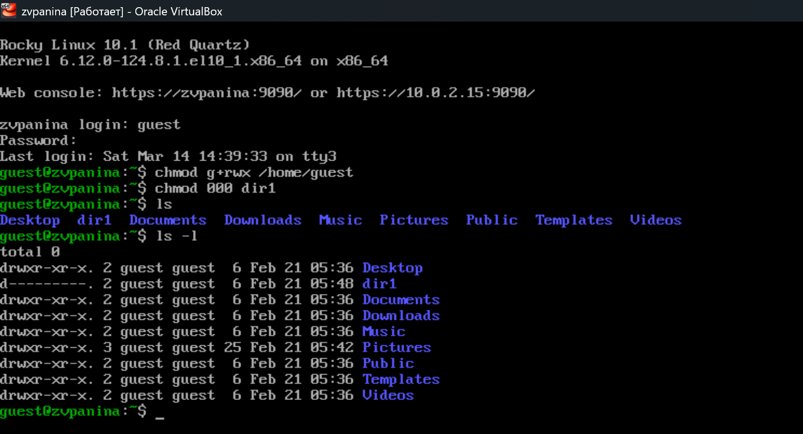
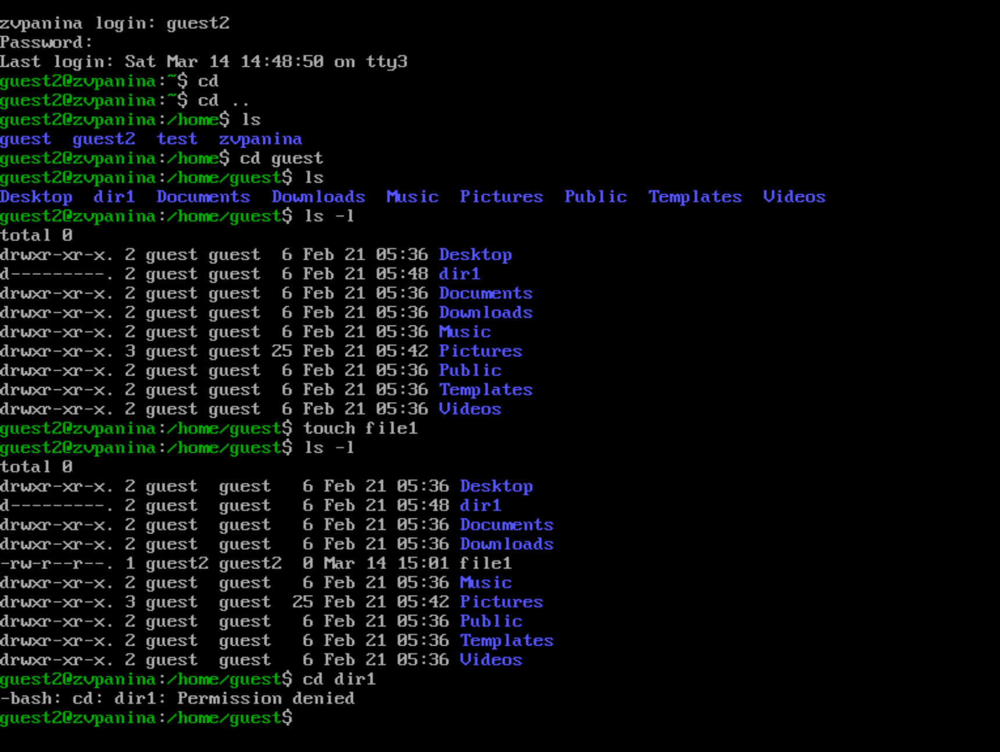

---
## Author
author:
  name: Панина Жанна Валерьевна
  degrees: бакалавр
  orcid: 
  email: 1132246710@rudn.ru
  affiliation:
    - name: Российский университет дружбы народов
      country: Российская Федерация
      postal-code: 
      city: Москва
      address: ул. Миклухо-Маклая, д. 6
## Title
title: Лабораторная работа №3
subtitle: Дискреционное разграничение прав в Linux. Два пользователя"
license: CC BY
date: today
date-format: "2026-03-21" 
---

# Информация

## Докладчик

:::::::::::::: {.columns align=center}
::: {.column width="70%"}

  Панина Жанна Валерьевна
  студентка НКАбд-02-24
  Российский университет дружбы народов им. П. Лумумбы
  [1132246710@rudn.ru](mailto:1132246710@rudn.ru)
  <https://github.com/zvpanina/study_2025-2026_infosec-intro>

:::
::::::::::::::

# Вводная часть

## Цель работы

Получение практических навыков работы в консоли с атрибутами файлов для групп пользователей

## Задание

1. Создание пользователя guest2, добавление его в группу пользователей guest
2. Заполнение таблицы 3.1
3. Заполнение таблицы 3.2 на основе таблицы 3.1.

## Теоретическое введение

Права доступа определяют, какие действия конкретный пользователь может или не может совершать с определенным файлами и каталогами. С помощью разрешений можно создать надежную среду — такую, в которой никто не может поменять содержимое ваших документов или повредить системные файлы. [1]

Группы пользователей Linux кроме стандартных root и users, здесь есть еще пару десятков групп. Это группы, созданные программами, для управления доступом этих программ к общим ресурсам. Каждая группа разрешает чтение или запись определенного файла или каталога системы, тем самым регулируя полномочия пользователя, а следовательно, и процесса, запущенного от этого пользователя. Здесь можно считать, что пользователь - это одно и то же что процесс, потому что у процесса все полномочия пользователя, от которого он запущен. [2]

- daemon - от имени этой группы и пользователя daemon запускаютcя сервисы, которым необходима возможность записи файлов на диск.
- sys - группа открывает доступ к исходникам ядра и файлам - include сохраненным в системе
- sync - позволяет выполнять команду /bin/sync
- games - разрешает играм записывать свои файлы настроек и историю в определенную папку
- man - позволяет добавлять страницы в директорию /var/cache/man
- lp - позволяет использовать устройства параллельных портов
- mail - позволяет записывать данные в почтовые ящики /var/mail/

##

- proxy - используется прокси серверами, нет доступа записи файлов на диск
- www-data - с этой группой запускается веб-сервер, она дает доступ на запись /var/www, где находятся файлы веб-документов
- list - позволяет просматривать сообщения в /var/mail
- nogroup - используется для процессов, которые не могут создавать файлов на жестком диске, а только читать, обычно применяется вместе с пользователем nobody.
- adm - позволяет читать логи из директории /var/log
- tty - все устройства /dev/vca разрешают доступ на чтение и запись пользователям из этой группы
- disk - открывает доступ к жестким дискам /dev/sd* /dev/hd*, можно сказать, что это аналог рут доступа.
- dialout - полный доступ к серийному порту
- cdrom - доступ к CD-ROM

##

- wheel - позволяет запускать утилиту sudo для повышения привилегий
- audio - управление аудиодрайвером
- src - полный доступ к исходникам в каталоге /usr/src/
- shadow - разрешает чтение файла /etc/shadow
- utmp - разрешает запись в файлы /var/log/utmp /var/log/wtmp
- video - позволяет работать с видеодрайвером
- plugdev - позволяет монтировать внешние устройства USB, CD и т д
- staff - разрешает запись в папку /usr/local

# Выполнение лабораторной работы

1. В установленной операционной системе создаю учётную запись пользователя guest (использую учётную запись администратора) ([рис. @fig-001]). Задаю пароль для пользователя guest (использую учётную запись администратора). Аналогично создаю второго пользователя guest2.

{#fig-001 width=70%}

##

2. Добавляю пользователя guest2 в группу guest ([рис. @fig-002]).

{#fig-002 width=70%}

##

3. Осуществляю вход в систему от двух пользователей через консоль tty по очереди: сначала guest ([рис. @fig-003]). Командой pwd определяю директорию, в которой я нахожусь. С приглашением командной строки она не совпадает.

{#fig-003 width=70%}

##

4. То же самое проделываю от имени пользователя guest2. Результат такой же ([рис. @fig-004]).

{#fig-004 width=70%}

##

5. Уточняю имя моего пользователя, его группу, кто входит в неё и к каким группам принадлежит он сам. Определяю командами ```groups guest``` и ```groups guest2```, в какие группы входят пользователи guest и guest2 ([рис. @fig-005]). Команда ```id -Gn``` выводит названия групп, которым принадлежит пользователь, а ```id -G``` - только код групп, которым принадлежит пользователь.

{#fig-005 width=70%}

##

6. Сравниваю полученную информацию с содержимым файла /etc/group, просмотрев файл командой ```cat /etc/group``` ([рис. @fig-006]).

{#fig-006 width=70%}

##

7. От имени пользователя guest2 выполняю регистрацию пользователя guest2 в группе guest командой ```newgrp guest``` ([рис. @fig-007]).

{#fig-007 width=70%}

##

8. От имени пользователя guest изменяю права директории /home/guest, разрешив все действия для пользователей группы ([рис. @fig-008]).

{#fig-008 width=70%}

##

9. От имени пользователя guest снимаю с директории /home/guest/dir1 все атрибуты командой ```chmod 000 dirl``` ([рис. @fig-009]).

{#fig-009 width=70%}

## Заполнение таблицы 3.1

Заполняю табл. 3.1, определив опытным путём, какие операции разрешены, а какие нет.

| Права директории | Права файла | Создание файла| Удаление файла | Запись в файл | Чтение файла | Смена директории | Просмотр файлов в директории | Переименование файл | Смена атрибутов файла |
|:---------------------|:---------------------|-----|-----|-----|-----|-----|-----|-----|-----|
|```d-------— (000)```|```--------— (000)```| - | - | - | - | - | - | - | - |
|```d-----x-— (010)```|```--------— (000)```| - | - | - | - | - | - | - | + |
|```d----w--— (020)```|```--------— (000)```| - | - | - | - | - | - | - | - |
|```d----wx-— (030)```|```--------— (000)```| + | + | - | - | + | - | + | + |
|```d---r---— (040)```|```--------— (000)```| - | - | - | - | - | + | - | - |
|```d---r-x-— (050)```|```--------— (000)```| - | - | - | - | + | + | - | + |
|```d---rw--— (060)```|```--------— (000)```| - | - | - | - | - | + | - | - |
|```d---rwx-— (070)```|```--------— (000)```| + | + | - | - | + | + | + | + |
|```d-------— (000)```|```------x-— (010)```| - | - | - | - | - | - | - | - |
|```d-----x-— (010)```|```------x-— (010)```| - | - | - | - | - | - | - | + |
|```d----w--— (020)```|```------x-— (010)```| - | - | - | - | - | - | - | - |
|```d----wx-— (030)```|```------x-— (010)```| + | + | - | - | + | - | + | + |
|```d---r---— (040)```|```------x-— (010)```| - | - | - | - | - | + | - | - |
|```d---r-x-— (050)```|```------x-— (010)```| - | - | - | - | + | + | - | + |
|```d---rw--— (060)```|```------x-— (010)```| - | - | - | - | - | + | - | - |
|```d---rwx-— (070)```|```------x-— (010)```| + | + | - | - | + | + | + | + |
|```d-------— (000)```|```-----w--— (020)```| - | - | - | - | - | - | - | - |
|```d-----x-— (010)```|```-----w--— (020)```| - | - | + | - | - | - | - | + |
|```d----w--— (020)```|```-----w--— (020)```| - | - | - | - | - | - | - | - |
|```d----wx-— (030)```|```-----w--— (020)```| + | + | + | - | + | - | + | + |
|```d---r---— (040)```|```-----w--— (020)```| - | - | - | - | - | + | - | - |
|```d---r-x-— (050)```|```-----w--— (020)```| - | - | + | - | + | + | - | + |
|```d---rw--— (060)```|```-----w--— (020)```| - | - | - | - | - | + | - | - |
|```d---rwx-— (070)```|```-----w--— (020)```| + | + | + | - | + | + | + | + |
|```d-------— (000)```|```-----wx-— (030)```| - | - | - | - | - | - | - | - |
|```d-----x-— (010)```|```-----wx-— (030)```| - | - | + | - | - | - | - | + |
|```d----w--— (020)```|```-----wx-— (030)```| - | - | - | - | - | - | - | - |
|```d----wx-— (030)```|```-----wx-— (030)```| + | + | + | - | + | - | + | + |
|```d---r---— (040)```|```-----wx-— (030)```| - | - | - | - | - | + | - | - |
|```d---r-x-— (050)```|```-----wx-— (030)```| - | - | + | - | + | + | - | + |
|```d---rw--— (060)```|```-----wx-— (030)```| - | - | - | - | - | + | - | - |
|```d---rwx-— (070)```|```-----wx-— (030)```| + | + | + | - | + | + | + | + |
|```d-------— (000)```|```----r---— (040)```| - | - | - | - | - | - | - | - |
|```d-----x-— (010)```|```----r---— (040)```| - | - | - | + | + | - | - | + |
|```d----w--— (020)```|```----r---— (040)```| - | - | - | - | - | - | - | - |
|```d----wx-— (030)```|```----r---— (040)```| + | + | - | + | + | - | + | + |
|```d---r---— (040)```|```----r---— (040)```| - | - | - | - | - | + | - | - |
|```d---r-x-— (050)```|```----r---— (040)```| - | - | - | + | + | + | - | + |
|```d---rw--— (060)```|```----r---— (040)```| - | - | - | - | - | + | - | - |
|```d---rwx-— (070)```|```----r---— (040)```| + | + | - | + | + | + | + | + |
|```d-------— (000)```|```----r-x-— (050)```| - | - | - | - | - | - | - | - |
|```d-----x-— (010)```|```----r-x-— (050)```| - | - | - | + | + | - | - | + |
|```d----w--— (020)```|```----r-x-— (050)```| - | - | - | - | - | - | - | - |
|```d----wx-— (030)```|```----r-x-— (050)```| + | + | - | + | + | - | + | + |
|```d---r---— (040)```|```----r-x-— (050)```| - | - | - | - | - | + | - | - |
|```d---r-x-— (050)```|```----r-x-— (050)```| - | - | - | + | + | + | - | + |
|```d---rw--— (060)```|```----r-x-— (050)```| - | -| - | - | - | + | - | - |
|```d---rwx-— (070)```|```----r-x-— (050)```| + | + | - | + | + | + | + | + |
|```d-------— (000)```|```----rw--— (060)```| - | - | - | - | - | - | - | - |
|```d-----x-— (010)```|```----rw--— (060)```| - | - | + | + | - | - | - | + |
|```d----w--— (020)```|```----rw--— (060)```| - | - | - | - | - | - | - | - |
|```d----wx-— (030)```|```----rw--— (060)```| + | + | + | + | + | - | + | + |
|```d---r---— (040)```|```----rw--— (060)```| - | - | - | - | - | + | - | - |
|```d---r-x-— (050)```|```----rw--— (060)```| - | - | + | + | + | + | - | + |
|```d---rw--— (060)```|```----rw--— (060)```| - | - | - | - | - | + | - | - |
|```d---rwx-— (070)```|```----rw--— (060)```| + | + | + | + | + | + | + | + |
|```d-------— (000)```|```----rwx-— (070)```| - | - | - | - | - | - | - | - |
|```d-----x-— (010)```|```----rwx-— (070)```| - | - | + | + | + | - | - | + |
|```d----w--— (020)```|```----rwx-— (070)```| - | - | - | - | - | - | - | - |
|```d----wx-— (030)```|```----rwx-— (070)```| + | + | + | + | + | - | + | + |
|```d---r---— (040)```|```----rwx-— (070)```| - | - | - | - | - | + | - | - |
|```d---r-x-— (050)```|```----rwx-— (070)```| - | - | + | + | + | + | - | + |
|```d---rw--— (060)```|```----rwx-— (070)```| - | - | - | - | - | + | - | - |
|```d---rwx-— (070)```|```----rwx-— (070)```| + | + | + | + | + | + | + | + |

Таблица 3.1 «Установленные права и разрешённые действия для групп»

## Заполнение таблицы 3.2

На основе таблицы 3.1 заполняю таблицу 3.2.

| Операция | Права на директорию | Права на файл |
|------------------------|---------------------------------|---------------------------|
| Создание файла | ```d----wx-— (030)``` | ```--------— (000)``` |
| Удаление файла | ```d----wx-— (030)``` | ```--------— (000)``` |
| Чтение файла | ```d-----x-— (010)``` | ```----r---— (040)``` |
| Запись в файл | ```d-----x-— (010)``` | ```-----w--— (020)``` |
| Переименование файла | ```d----wx-— (030)``` | ```--------— (000)``` |
| Создание поддиректории | ```d----wx-— (030)``` | ```--------— (000)``` |
| Удаление поддиректории | ```d----wx-— (030)``` | ```--------— (000)``` |

Таблица 3.2 «Минимальные права для совершения операций от имени пользователей входящих в группу»

# Результаты

В ходе работы я получила практические навыки работы в консоли с атрибутами файлов для групп пользователей.

:::
