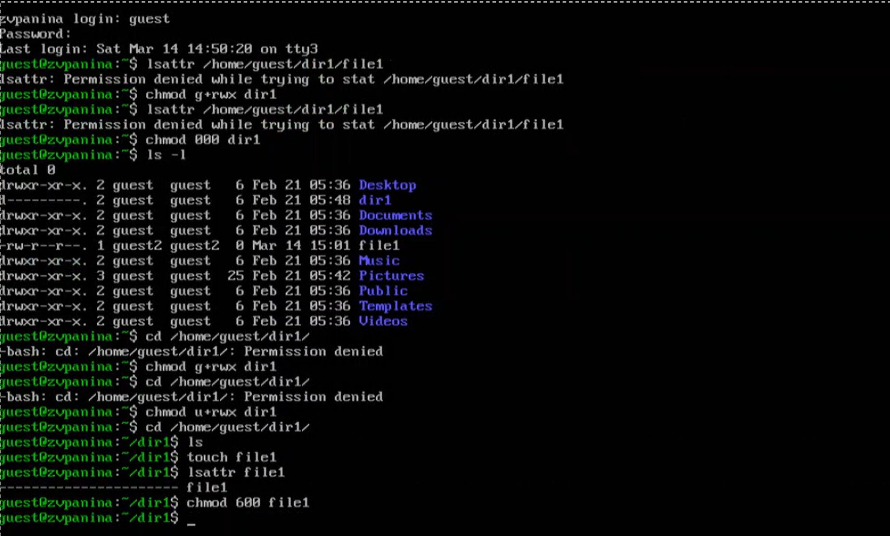
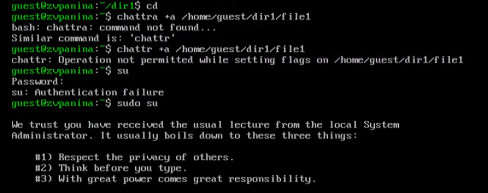
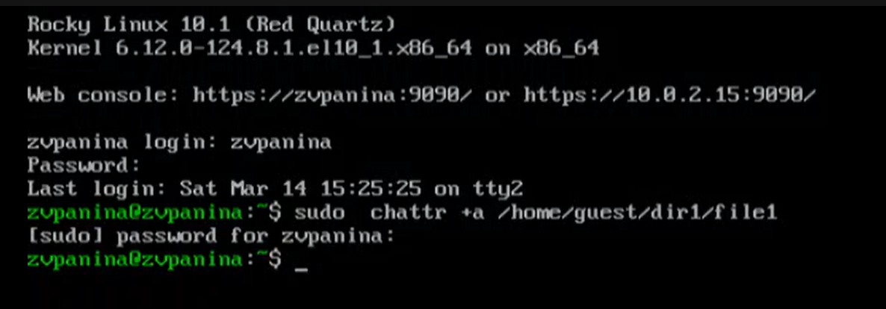
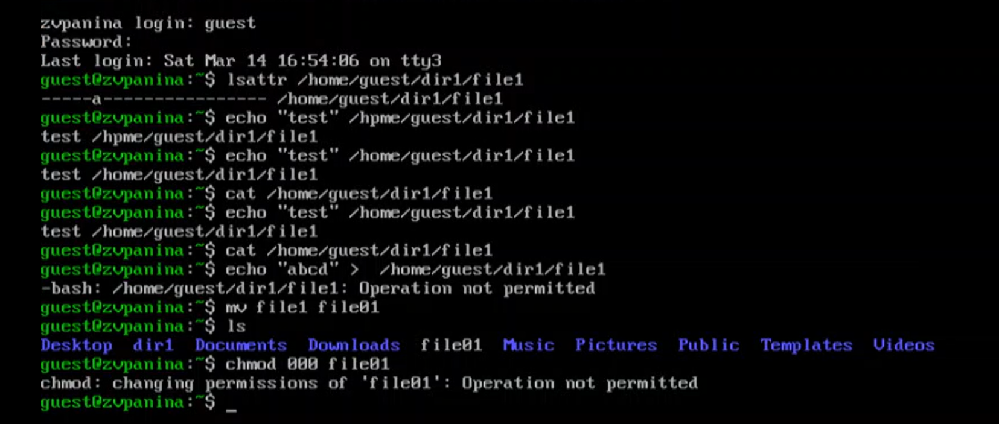
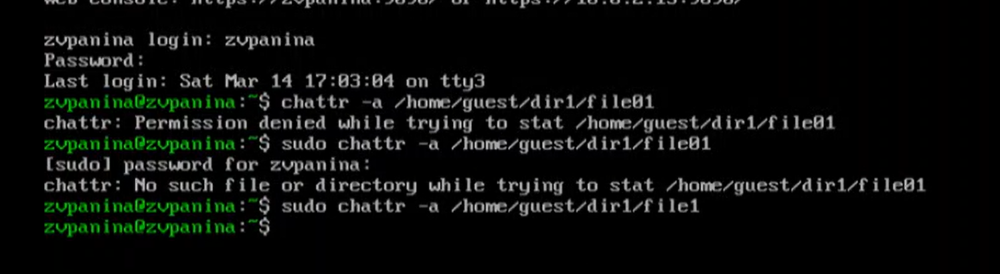
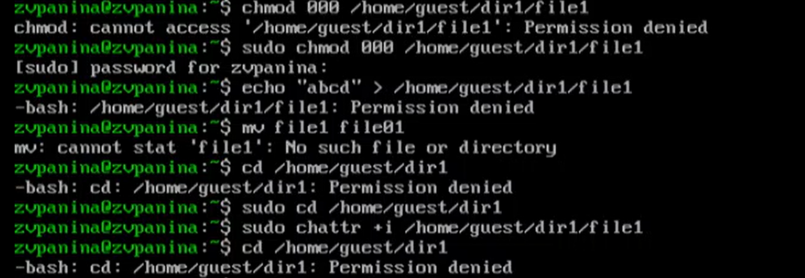
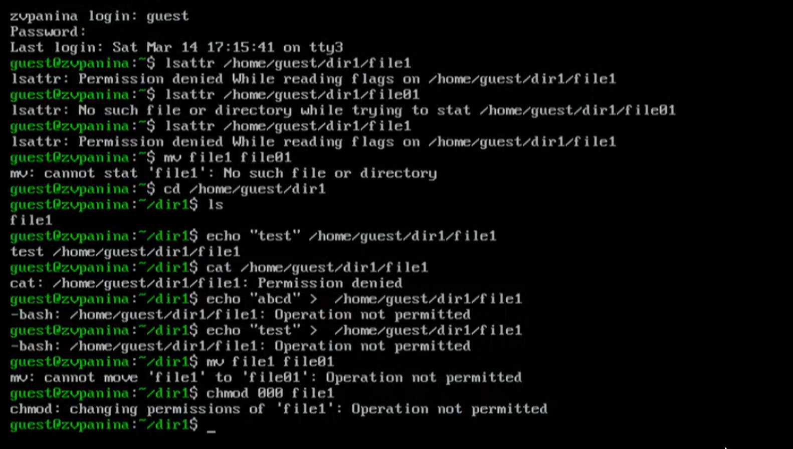

---
## Author
author:
  name: Панина Жанна Валерьевна
  degrees: bachelor
  orcid: 
  email: 1132246710@rudn.ru
  affiliation:
    - name: Российский университет дружбы народов
      country: Российская Федерация
      postal-code: 
      city: Москва
      address: ул. Миклухо-Маклая, д. 6

## Title
title: "Отчёт по лабораторной работе №4"
subtitle: "Дискреционное разграничение прав в Linux. Расширенные атрибуты"
license: "CC BY"
---

# Цель работы

Получение практических навыков работы в консоли с расширенными атрибутами файлов.

# Теоретическое введение

Права доступа определяют, какие действия конкретный пользователь может или не может совершать с определенным файлами и каталогами. С помощью разрешений можно создать надежную среду — такую, в которой никто не может поменять содержимое ваших документов или повредить системные файлы. [1]

Расширенные атрибуты файлов Linux представляют собой пары имя:значение, которые постоянно связаны с файлами и каталогами, подобно тому как строки окружения связаны с процессом. Атрибут может быть определён или не определён. Если он определён, то его значение может быть или пустым, или не пустым. [2]

Расширенные атрибуты дополняют обычные атрибуты, которые связаны со всеми inode в файловой системе (т. е., данные stat(2)). Часто они используются для предоставления дополнительных возможностей файловой системы, например, дополнительные возможности безопасности, такие как списки контроля доступа (ACL), могут быть реализованы через расширенные атрибуты. [3]

*Установить атрибуты:*

- chattr filename

*Значения:*

- chattr +a # только добавление. Удаление и переименование запрещено;
- chattr +A # не фиксировать данные об обращении к файлу
- chattr +c # сжатый файл
- chattr +d # неархивируемый файл
- chattr +i # неизменяемый файл
- chattr +S # синхронное обновление
- chattr +s # безопасное удаление, (после удаления место на диске переписывается нулями)
- chattr +u # неудаляемый файл
- chattr -R # рекурсия

*Просмотреть атрибуты:*

- lsattr filename

*Опции:*

- lsattr -R # рекурсия
- lsattr -a # вывести все файлы (включая скрытые)
- lsattr -d # не выводить содержимое директории

# Выполнение работы

От имени пользователя guest определяю расширенные атрибуты файла /home/guest/dir1/file1 командой
```lsattr /home/guest/dir1/file1``` ([рис. @fig-001]). Устанавливаю командой ```chmod 600 file1``` на файл file1 права, разрешающие чтение и запись для владельца файла.

{#fig-001 width=70%}

2. Пробую установить на файл /home/guest/dir1/file1 расширенный атрибут a от имени пользователя guest:
```chattr +a /home/guest/dir1/file1``` В ответ я должна получить отказ от выполнения операции. Повышаю свои права с помощью команды ```su```. ([рис. @fig-002]).

{#fig-002 width=70%}

3. Пробую установить расширенный атрибут a на файл /home/guest/dir1/file1 от имени суперпользователя ([рис. @fig-003]).

{#fig-003 width=70%}

4. От пользователя guest проверяю правильность установления атрибута: ```lsattr /home/guest/dir1/file1```. ([рис. @fig-004]). Выполняю дозапись в файл file1 слова «test» командой ```echo "test" /home/guest/dir1/file1```. После этого выполняю чтение файла file1 командой ```cat /home/guest/dir1/file1```. Попробую удалить файл file1 либо стереть имеющуюся в нём информацию командой ```echo "abcd" > /home/guest/dirl/file1``` Пробую переименовать файл. Пробую с помощью команды ```chmod 000 file1``` установить на файл file1 права, например, запрещающие чтение и запись для владельца файла. 

{#fig-004 width=70%}

5. Снимаю расширенный атрибут a с файла /home/guest/dirl/file1 от имени суперпользователя ([рис. @fig-005]).

{#fig-005 width=70%}

6. Повторяю операции, которые мне ранее не удавалось выполнить. Везде отказано в доступе ([рис. @fig-006]).

{#fig-006 width=70%}

7. Повторяю свои действия по шагам, заменив атрибут «a» атрибутом «i». Дозапись в файл сделать не удаётся. ([рис. @fig-007]).

{#fig-007 width=70%}

# Выводы

В результате выполнения работы я повысила свои навыки использования интерфейса командой строки (CLI), познакомилась на примерах с тем, как используются основные и расширенные атрибуты при разграничении доступа. Имела возможность связать теорию дискреционного разделения доступа (дискреционная политика безопасности) с её реализацией на практике в ОС Linux. Опробовала действие на практике расширенных атрибутов «а» и «i».

# Список литературы{.unnumbered}

[Лабораторная работа №4](https://esystem.rudn.ru/pluginfile.php/3096711/mod_resource/content/3/004-lab_discret_extattr.pdf)

:::
