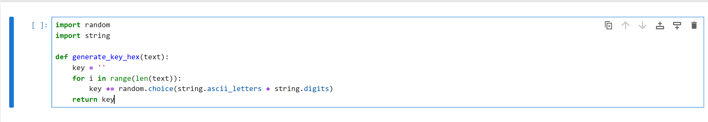
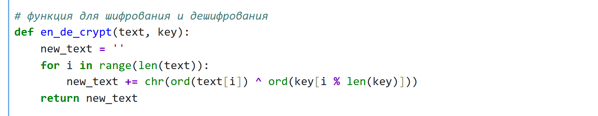
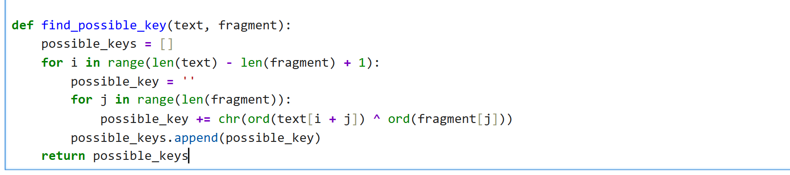
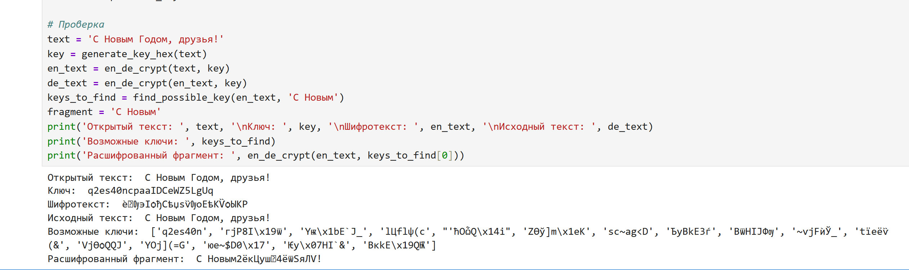

---
## Author
author:
  name: Панина Жанна Валерьевна
  degrees: bachelor
  orcid: 
  email: 1132246710@rudn.ru
  affiliation:
    - name: Российский университет дружбы народов
      country: Российская Федерация
      postal-code: 
      city: Москва
      address: ул. Миклухо-Маклая, д. 6

## Title
title: "Отчёт по лабораторной работе №7"
subtitle: "Элементы криптографии. Однократное гаммирование"
license: "CC BY"
---

# Цель работы

Освоить на практике применение режима однократного гаммирования

# Задание

Нужно подобрать ключ, чтобы получить сообщение «С Новым Годом,
друзья!». Требуется разработать приложение, позволяющее шифровать и
дешифровать данные в режиме однократного гаммирования. Приложение
должно:
1. Определить вид шифротекста при известном ключе и известном открытом тексте.
2. Определить ключ, с помощью которого шифротекст может быть преобразован в некоторый фрагмент текста, представляющий собой один из возможных вариантов прочтения открытого текста

# Теоретическое введение

Предложенная Г. С. Вернамом так называемая «схема однократного использования (гаммирования)» является простой, но надёжной схемой шифрования данных.

Гаммирование представляет собой наложение (снятие) на открытые (зашифрованные) данные последовательности элементов других данных, полученной с помощью некоторого криптографического алгоритма, для получения зашифрованных (открытых) данных. Иными словами, наложение
гаммы — это сложение её элементов с элементами открытого (закрытого)
текста по некоторому фиксированному модулю, значение которого представляет собой известную часть алгоритма шифрования.

В соответствии с теорией криптоанализа, если в методе шифрования используется однократная вероятностная гамма (однократное гаммирование)
той же длины, что и подлежащий сокрытию текст, то текст нельзя раскрыть.
Даже при раскрытии части последовательности гаммы нельзя получить информацию о всём скрываемом тексте.

Наложение гаммы по сути представляет собой выполнение операции
сложения по модулю 2 (XOR) (обозначаемая знаком ⊕) между элементами
гаммы и элементами подлежащего сокрытию текста. Напомним, как работает операция XOR над битами: 0 ⊕ 0 = 0, 0 ⊕ 1 = 1, 1 ⊕ 0 = 1, 1 ⊕ 1 = 0.

Такой метод шифрования является симметричным, так как двойное прибавление одной и той же величины по модулю 2 восстанавливает исходное значение, а шифрование и расшифрование выполняется одной и той же программой.

Если известны ключ и открытый текст, то задача нахождения шифротекста заключается в применении к каждому символу открытого текста следующего правила: 

Ci = Pi ⊕ Ki, (7.1)

*где Ci — i-й символ получившегося зашифрованного послания, Pi — i-й
символ открытого текста, Ki — i-й символ ключа, i = 1, m. Размерности
открытого текста и ключа должны совпадать, и полученный шифротекст
будет такой же длины.*

Если известны шифротекст и открытый текст, то задача нахождения
ключа решается также в соответствии с (7.1), а именно, обе части равенства необходимо сложить по модулю 2 с Pi:

Ci ⊕ Pi = Pi ⊕ Ki ⊕ Pi = Ki,

Ki = Ci ⊕ Pi.

Открытый текст имеет символьный вид, а ключ — шестнадцатеричное
представление. Ключ также можно представить в символьном виде, воспользовавшись таблицей ASCII-кодов.

К. Шеннон доказал абсолютную стойкость шифра в случае, когда однократно используемый ключ, длиной, равной длине исходного сообщения,
является фрагментом истинно случайной двоичной последовательности с
равномерным законом распределения. Криптоалгоритм не даёт никакой информации об открытом тексте: при известном зашифрованном сообщении
C все различные ключевые последовательности K возможны и равновероятны, а значит, возможны и любые сообщения P.

Необходимые и достаточные условия абсолютной стойкости шифра:

- полная случайность ключа;

- равенство длин ключа и открытого текста;

- однократное использование ключа.

Рассмотрим пример.

Ключ Центра:

05 0C 17 7F 0E 4E 37 D2 94 10 09 2E 22 57 FF C8 0B B2 70 54

Сообщение Центра:

*Штирлиц – Вы Герой!!*

D8 F2 E8 F0 EB E8 F6 20 2D 20 C2 FB 20 C3 E5 F0 EE E9 21 21

Зашифрованный текст, находящийся у Мюллера:

DD FE FF 8F E5 A6 C1 F2 B9 30 CB D5 02 94 1A 38 E5 5B 51 75

Дешифровальщики попробовали ключ:

05 0C 17 7F 0E 4E 37 D2 94 10 09 2E 22 55 F4 D3 07 BB BC 54

и получили текст:

D8 F2 E8 F0 EB E8 F6 20 2D 20 C2 FB 20 C1 EE EB E2 E0 ED 21

*Штирлиц - Вы Болван!*

Другие ключи дадут лишь новые фразы, пословицы, стихотворные
строфы, словом, всевозможные тексты заданной длины.

# Выполнение лабораторной работы

Я выполняла лабораторную работу на языке программирования Python. Ниже приложила листинг программы и результаты выполнения.

Начинаю с импорта библиотек и написания функции для генерации случайного ключа ([рис. @fig-001]).

{#fig-001 width=70%}

Далее создаю одну функцию - и для шифрования, и для дешифрования ([рис. @fig-002]).

{#fig-002 width=70%}

Нужно определить ключ, с помощью которого шифротекст может быть преобразован в некоторый фрагмент текста, представляющий собой один из возможных вариантов прочтения открытого текста. Для этого пишу функцию  для нахождения возможных ключей для фрагмента текста ([рис. @fig-003]).

{#fig-003 width=70%}

После написания всех  функций необходимо проверить корректность их работы. Шифрование и дешифрование происходит верно, как и нахождение ключей, с помощью которых можно расшифровать верно только кусок текста ([рис. @fig-004]).

{#fig-004 width=70%}

Листинг программы:

```python

import random
import string

def generate_key_hex(text):
    key = ''
    for i in range(len(text)):
        key += random.choice(string.ascii_letters + string.digits)
    return key
    
# функция для шифрования и дешифрования
def en_de_crypt(text, key):
    new_text = ''
    for i in range(len(text)):
        new_text += chr(ord(text[i]) ^ ord(key[i % len(key)]))
    return new_text

def find_possible_key(text, fragment):
    possible_keys = []
    for i in range(len(text) - len(fragment) + 1):
        possible_key = ''
        for j in range(len(fragment)):
            possible_key += chr(ord(text[i + j]) ^ ord(fragment[j]))
        possible_keys.append(possible_key)
    return possible_keys

# Проверка    
text = 'С Новым Годом, друзья!'
key = generate_key_hex(text)
en_text = en_de_crypt(text, key)
de_text = en_de_crypt(en_text, key)
keys_to_find = find_possible_key(en_text, 'С Новым')
fragment = 'С Новым'
print('Открытый текст: ', text, '\nКлюч: ', key, '\nШифротекст: ', en_text, '\nИсходный текст: ', de_text)
print('Возможные ключи: ', keys_to_find)
print('Расшифрованный фрагмент: ', en_de_crypt(en_text, keys_to_find[0]))
```

# Ответы на контрольные вопросы

1. Поясните смысл однократного гаммирования. 

- Однократное гаммирование - это метод шифрования, при котором каждый символ открытого текста гаммируется с соответствующим символом ключа только один раз.

2. Перечислите недостатки однократного гаммирования. - Недостатки однократного гаммирования:

- Уязвимость к частотному анализу из-за сохранения частоты символов открытого текста в шифротексте.
- Необходимость использования одноразового ключа, который должен быть длиннее самого открытого текста.
- Нет возможности использовать один ключ для шифрования разных сообщений.

3. Перечислите преимущества однократного гаммирования. Преимущества однократного гаммирования:

- Высокая стойкость при правильном использовании случайного ключа.
- Простота реализации алгоритма.
- Возможность использования случайного ключа.

4. Почему длина открытого текста должна совпадать с длиной ключа? 

- Длина открытого текста должна совпадать с длиной ключа, чтобы каждый символ открытого текста гаммировался с соответствующим символом ключа.

5. Какая операция используется в режиме однократного гаммирования, назовите её особенности? 

- В режиме однократного гаммирования используется операция XOR (исключающее ИЛИ), которая объединяет двоичные значения символов открытого текста и ключа для получения шифротекста. Особенность XOR - если один из битов равен 1, то результат будет 1, иначе 0.

6. Как по открытому тексту и ключу получить шифротекст? 

- Для получения шифротекста по открытому тексту и ключу каждый символ открытого текста гаммируется с соответствующим символом ключа с помощью операции XOR.
 
7. Как по открытому тексту и шифротексту получить ключ?

- По открытому тексту и шифротексту невозможно восстановить действительный ключ, так как для этого нужна информация о каждом символе ключа. 

8. В чем заключаются необходимые и достаточные условия абсолютной стойкости шифра? 

 Необходимые и достаточные условия абсолютной стойкости шифра:
 
- Ключи должны быть случайными и использоваться только один раз.
- Длина ключа должна быть не менее длины самого открытого текста.
- Ключи должны быть храниться и передаваться безопасным способом.


# Выводы

В ходе выполнения работы я освоила на практике применение режима однократного гаммирования.

# Список литературы{.unnumbered}

::: {#refs}
:::
