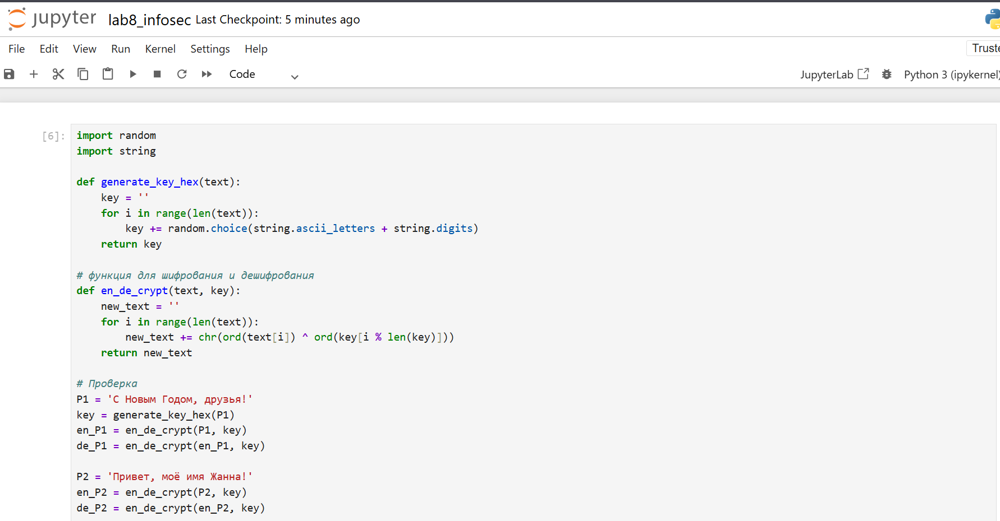
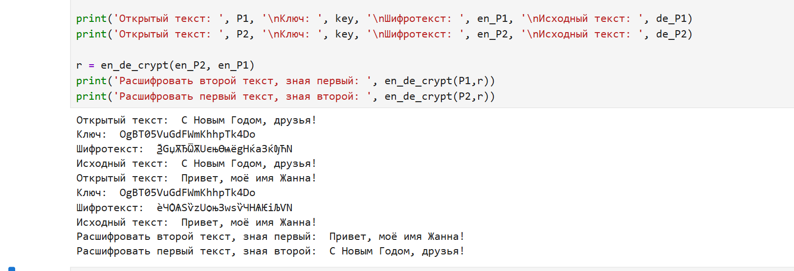

---
## Author
author:
  name: Панина Жанна Валерьевна
  degrees: bachelor
  orcid: 
  email: 1132246710@rudn.ru
  affiliation:
    - name: Российский университет дружбы народов
      country: Российская Федерация
      postal-code: 
      city: Москва
      address: ул. Миклухо-Маклая, д. 6

## Title
title: "Лабораторная работа №8"
subtitle: "Основы информационной безопасности"
license: "CC BY"
---


# Цель работы

Освоить на практике применение режима однократного гаммирования на примере кодирования различных исходных текстов одним ключом

# Задание

Два текста кодируются одним ключом (однократное гаммирование).
Требуется не зная ключа и не стремясь его определить, прочитать оба текста. Необходимо разработать приложение, позволяющее шифровать и дешифровать тексты P1 и P2 в режиме однократного гаммирования. Приложение должно определить вид шифротекстов C1 и C2 обоих текстов P1 и
P2 при известном ключе ; Необходимо определить и выразить аналитически способ, при котором злоумышленник может прочитать оба текста, не
зная ключа и не стремясь его определить.

# Теоретическое введение

Исходные данные.

Две телеграммы Центра:

$P_1$ = НаВашисходящийот1204

$P_2$ = ВСеверныйфилиалБанка

Ключ Центра длиной 20 байт:
K = 05 0C 17 7F 0E 4E 37 D2 94 10 09 2E 22 57 FF C8 OB B2 70 54

Шифротексты обеих телеграмм можно получить по формулам режима
однократного гаммирования:

$C_1 = P_1 ⊕ K$,

$C_2$ = P_2 ⊕ K$. (8.1)

Открытый текст можно найти, зная шифротекст двух телеграмм, зашифрованных одним ключом. Для это оба равенства (8.1) складываются по модулю 2. Тогда с учётом свойства операции XOR

$$1 ⊕ 1 = 0, 1 ⊕ 0 = 1 (8.2)$$

получаем:

$$C_1 ⊕ C_2 = P_1 ⊕ K ⊕ P_2 ⊕ K = P1 ⊕ P_2.$$

Предположим, что одна из телеграмм является шаблоном — т.е. имеет текст фиксированный формат, в который вписываются значения полей.
Допустим, что злоумышленнику этот формат известен. Тогда он получает
достаточно много пар $C_1 ⊕ C_2$ (известен вид обеих шифровок). Тогда зная
$P_1$ и учитывая (8.2), имеем:

$C_1 ⊕ C_2 ⊕ P_1 = P_1 ⊕ P_2 ⊕ P_1 = P_2. (8.3)$

Таким образом, злоумышленник получает возможность определить те
символы сообщения $P_2$, которые находятся на позициях известного шаблона сообщения $P_1$. В соответствии с логикой сообщения $P_2$, злоумышленник имеет реальный шанс узнать ещё некоторое количество символов сообщения $P_2$. Затем вновь используется (8.3) с подстановкой вместо P1 полученных на предыдущем шаге новых символов сообщения $P_2$. И так далее.
Действуя подобным образом, злоумышленник даже если не прочитает оба
сообщения, то значительно уменьшит пространство их поиска.

# Выполнение лабораторной работы

Я выполняла лабораторную работу на языке программирования Python, и функции взяла из предыдущей лабораторной, поскольку они связаны между собой.

Используя функцию для генерации ключа, создаю ключ, затем шифрую два разных текста одним и тем же ключом ([рис. @fig-001]).

{#fig-001 width=70%}

Расшифровываю оба текста сначала с помощью одного ключа, затем предполагаю, что мне неизвестен ключ, но известен один из текстов и уже расшифровываю второй, зная шифротексты и первый текст ([рис. @fig-002]).

{#fig-002 width=70%}

Листинг программы:

```python
import random
import string

def generate_key_hex(text):
    key = ''
    for i in range(len(text)):
        key += random.choice(string.ascii_letters + string.digits)
    return key
    
# функция для шифрования и дешифрования
def en_de_crypt(text, key):
    new_text = ''
    for i in range(len(text)):
        new_text += chr(ord(text[i]) ^ ord(key[i % len(key)]))
    return new_text

# Проверка    
P1 = 'С Новым Годом, друзья!'
key = generate_key_hex(P1)
en_P1 = en_de_crypt(P1, key)
de_P1 = en_de_crypt(en_P1, key)

P2 = 'Привет, моё имя Жанна!'
en_P2 = en_de_crypt(P2, key)
de_P2 = en_de_crypt(en_P2, key)

print('Открытый текст: ', P1, '\nКлюч: ', key, '\nШифротекст: ', en_P1, '\nИсходный текст: ', de_P1)
print('Открытый текст: ', P2, '\nКлюч: ', key, '\nШифротекст: ', en_P2, '\nИсходный текст: ', de_P2)

r = en_de_crypt(en_P2, en_P1)
print('Расшифровать второй текст, зная первый: ', en_de_crypt(P1,r))
print('Расшифровать первый текст, зная второй: ', en_de_crypt(P2,r))
```

# Ответы на контрольные вопросы

1. Как, зная один из текстов ($P_1$ или $P_2$), определить другой, не зная при
этом ключа?

- Для определения другого текста ($P_2$) можно просто взять зашифрованные тексты $C_1 ⊕ C_2$, далее применить XOR к ним и к известному тексту: $C_1 ⊕ C_2 ⊕ P_1 = P_2$.

2. Что будет при повторном использовании ключа при шифровании текста?

- При повторном использовании ключа мы получим дешифрованный текст.

3. Как реализуется режим шифрования однократного гаммирования одним ключом двух открытых текстов?

- Режим шифрования однократного гаммирования одним ключом двух открытых текстов осуществляется путем XOR-ирования каждого бита первого текста с соответствующим битом ключа или второго текста.

4. Перечислите недостатки шифрования одним ключом двух открытых текстов

- Недостатки шифрования одним ключом двух открытых текстов включают возможность раскрытия ключа или текстов при известном открытом тексте.

5. Перечислите преимущества шифрования одним ключом двух открытых текстов

- Преимущества шифрования одним ключом двух открытых текстов включают использование одного ключа для зашифрования нескольких сообщений без необходимости создания нового ключа и выделения на него памяти.

# Выводы

В ходе выполнения работы я освоила на практике применение режима однократного гаммирования на примере кодирования различных исходных текстов одним ключом

# Список литературы{.unnumbered}


