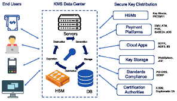
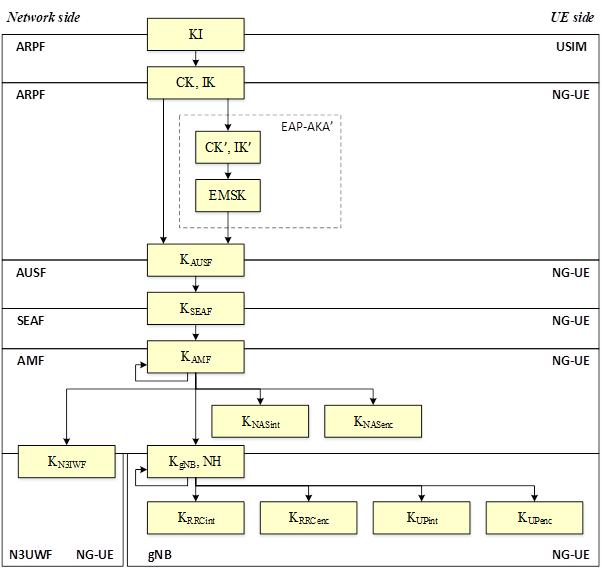
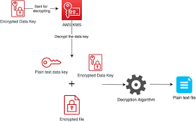
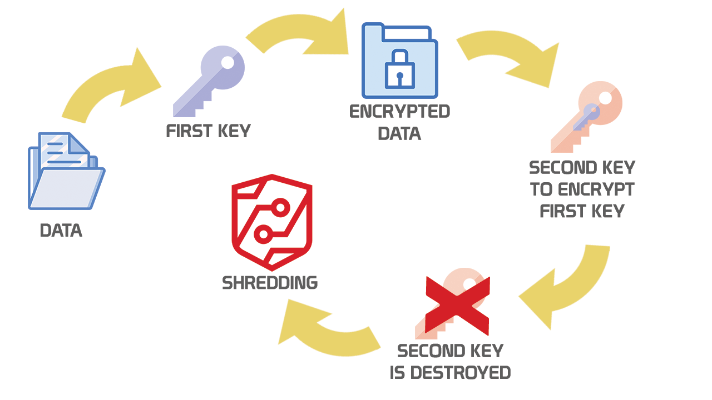

---
## Author
author:
  name: Панина Жанна Валерьевна
  degrees: бакалавр
  orcid: 
  email: 1132246710@rudn.ru
  affiliation:
    - name: Российский университет дружбы народов
      country: Российская Федерация
      postal-code: 
      city: Москва
      address: ул. Миклухо-Маклая, д. 6
## Title
title: Техники управления ключами. Основные концепции. Жизненный цикл управления ключами.
subtitle: Доклад к лекции на тему "Криптография"
license: CC BY
date: today
date-format: "2026-04-30" # Example: 2025-09-06
---

# Информация

## Докладчик

:::::::::::::: {.columns align=center}
::: {.column width="70%"}

  * Панина Жанна Валерьевна
  * студентка НКАбд-02-24
  * Российский университет дружбы народов им. П. Лумумбы
  * [1132246710@rudn.ru](mailto:1132246710@rudn.ru)
  * <https://github.com/zvpanina/study_2025-2026_infosec-intro>
  * Преподаватель: Кулябов Дмитрий Сергеевич, профессор кафедры теории вероятностей и кибербезопасности

:::
::: {.column width="30%"}

:::
::::::::::::::

# Вводная часть

## Актуальность

Актуальность темы обусловлена тем, что даже при использовании стойких алгоритмов ошибки в управлении ключами могут привести к компрометации всей системы.

## Объект и предмет исследования

**Объект исследования** - криптографические системы.

**Предмет исследования** - процессы и методы управления криптографическими ключами.

## Цели и задачи

**Цель работы** - изучить техники управления ключами и их жизненный цикл.

**Задачи:**

 - Рассмотреть основные концепции криптографических ключей;
 - Изучить методы управления ключами;
 - Проанализировать жизненный цикл ключа;
 - Определить практическую значимость управления ключами.

## Материалы и методы

**Материалы исследования:**

 - научная и учебная литература по криптографии
 - документация систем управления ключами (KMS)
 - открытые интернет-ресурсы и статьи

**Методы исследования:**

 - анализ теоретических источников
 - сравнительный анализ технологий управления ключами
 - обобщение и систематизация информации

# Основная часть

## Основные концепции управления ключами

Криптографический ключ представляет собой параметр алгоритма шифрования, обеспечивающий защиту информации. Согласно принципу Керкхоффса, безопасность системы должна зависеть только от секретности ключа, а не от алгоритма.

**Основные требования к ключам:**

 - случайность и и высокая энтропия;
 - уникальность;
 - защита от несанкционированного доступа;
 - ограниченный срок использования.

Ключи могут использоваться в симметричных и асимметричных криптосистемах, различающихся способом применения и распределения ключей.

## Техники управления ключами и их жизненный цикл

Управление криптографическими ключами представляет собой совокупность процессов, обеспечивающих безопасное создание, использование, хранение и уничножение ключей на протяжении всего их жизненного цикла.

##

{#fig-001 width=70%}

##

В отличие от абстрактного описания, управление ключами рассматривает как последовательность этапов (жизненный цикл), так и конкретные технические методы реализации каждого этапа.

Основные этапы:

1. **Генерация** - создание ключа.
2. **Распределение** - передача ключа пользователям.
3. **Использование** - применение ключа в криптографических операциях.
4. **Хранение** - обеспечение безопасности ключа в процессе эксплуатации.
5. **Ротация** - обновление ключа.
6. **Уничтожение** - удаление ключа после окончания срока десйствия.

## Генерация ключей

На этапе генерации создаются криптографические ключи, обладающие высокой степенью случайности. Используются программные генераторы псевдослучайных чисел (CSPRNG); аппаратные генераторы случайных чисел, основанные на физических источниках шума.

Качество генерации напрямую влияет на стойкость всей криптосистемы.

## Распределение и обмен ключами

Передача ключей между участниками является критически важным этапом. Применяются различные методы:

- защищённые каналы передачи;
- протокол Диффи-Хеллмана для согласования ключа по открытому каналу;
- использование асимметричного шифрования для передачи симметричных ключей;
- инкапсуляция ключей (key wrapping);
- диверсификация ключей на основе корневого ключа.

##

{#fig-002 width=70%}

## Хранение ключей

Безопасное хранение ключей обеспечивается с использованием специализированных технологий:

- HSM (аппаратные модули безопасности);
- TPM (доверенные платформенные модули);
- TEE (защищённые вычислительные среды);
- виртуальные HSM.

Также применяется иерархическая структура ключей: мастер-ключ; ключи шифрования ключей (KEK); ключи шифрования данных (DEK). 

##

{#fig-003 width=70%}

## Использование ключей

На этапе эксплуатации ключи применяются в соответствии с их назначением:

- шифрование и расшифрование данных;
- формирование и проверка цифровых подписей;
- аутентификация.

Важными параметрами являются криптопериод (срок действия ключа) и контекст использования (сессия, файл, сообщение).

## Ротация ключей

Ротация предполагает регулярную замену ключей с целью снижения риска компрометации:

- плановая замена по политике безопасности;
- внеплановая замена при угрозе компрометации;
- использование конвертного шифрования (envelope encryption).

##

{#fig-004 width=70%}

## Уничтожение ключей

На завершающем этапе ключи удаляются без возможности восстановлени: происходит перезапись памяти и физическое уничтожение носителей. Данный процесс известен как crypto-shredding. 

##

{#fig-005 width=70%}

## Ключевые технологии управления

Современные системы управления ключами реализуются с использованием специализированных решений:

- системы управления ключами (KMS); 
- протокол KMIP;
- инфраструктура открытых ключей (PKI);
- облачные сервисы управления ключами;
- модель BYOK (Bring Your Own Key).

## Принципы эффективного управления ключами

Эффективность системы управления ключами определяется соблюдением следующих принципов:

- минимизация срока жизни ключей;
- разделение ролей и функций ключей;
- аудит и мониторинг операций;
- централизованное управление ключами.

# Анализ и практическая значимость

Управление ключами широко применяется в современных технологиях:

- протоколы защищённой передачи данных (TLS/HTTPS);
- виртуальные частные сети (VPN);
- системы аутентификации;
- банковские системы.

Ошибки в управлении ключами являются одной из наиболее распространённых причин утечек данных.

# Результаты

- управление ключами — критически важный элемент безопасности
- компрометация ключей ведёт к компрометации всей системы
- современные технологии позволяют автоматизировать управление
