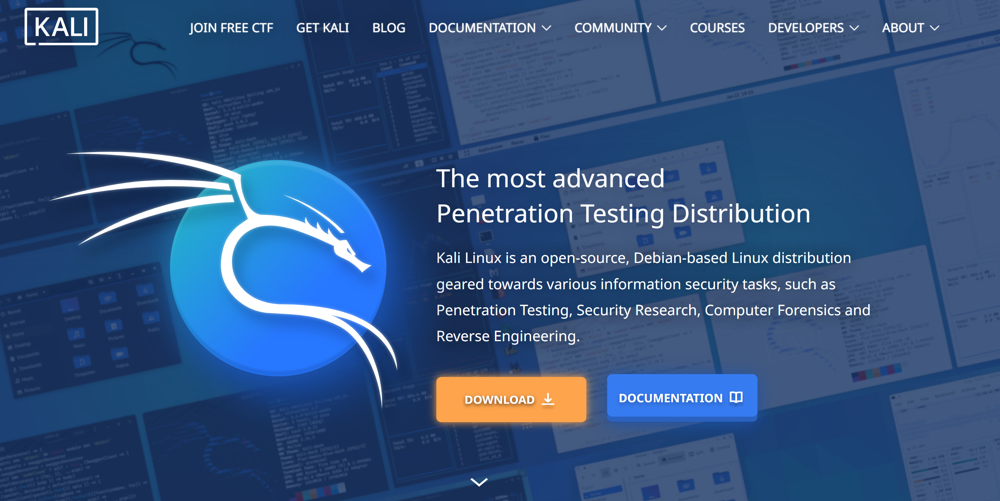
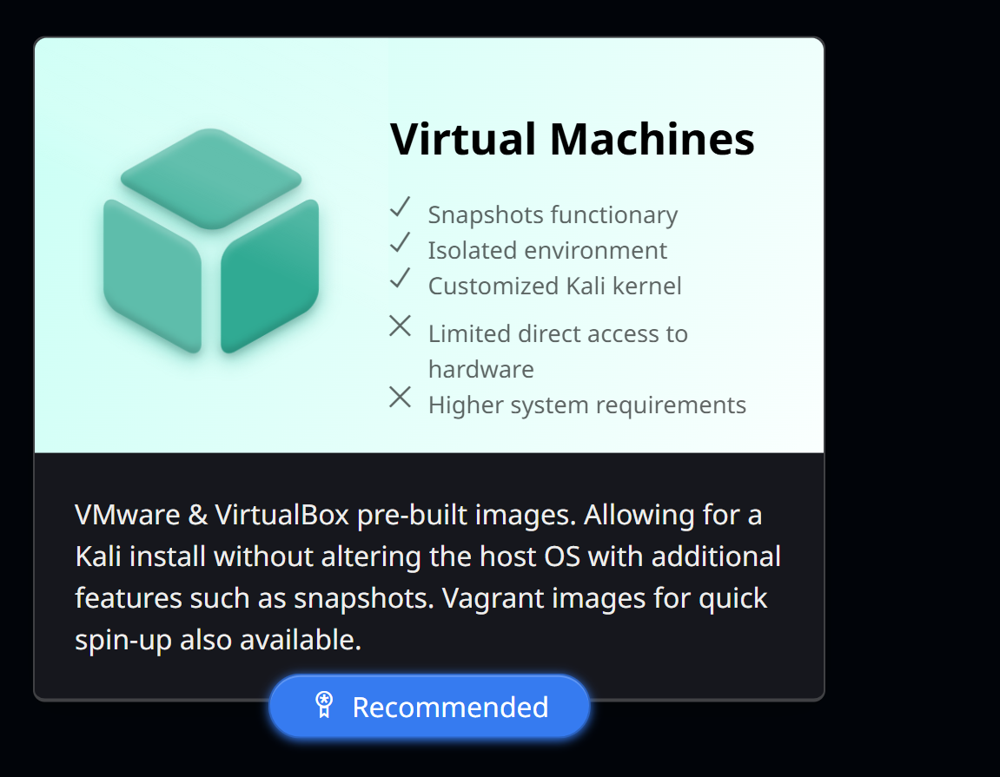
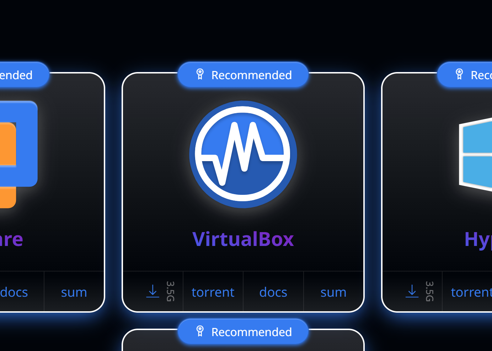
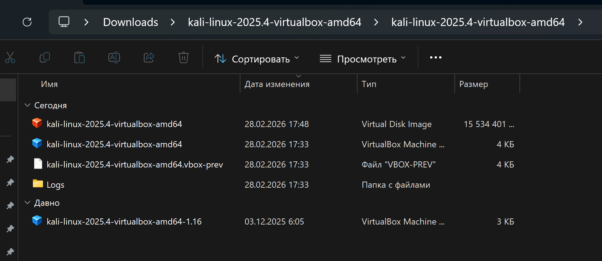
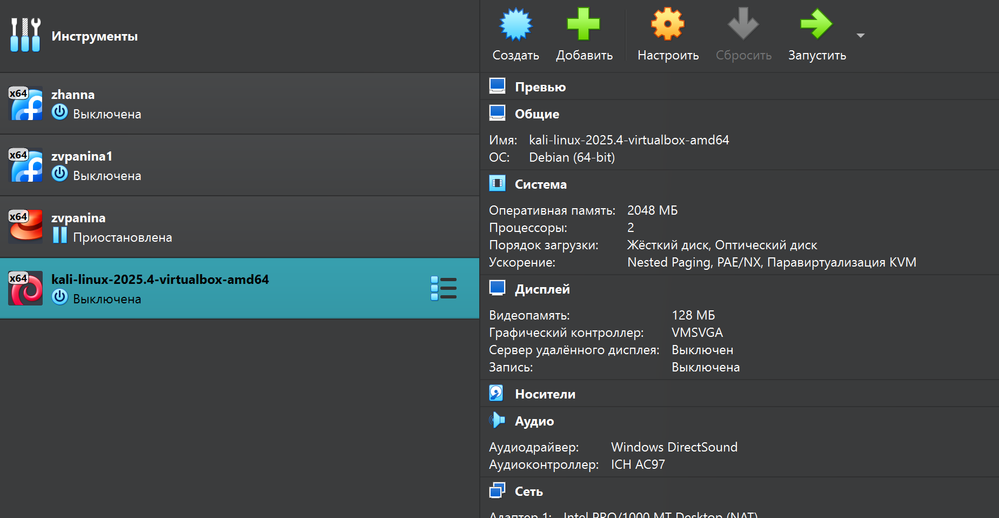
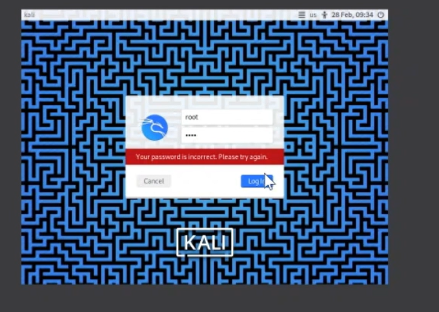
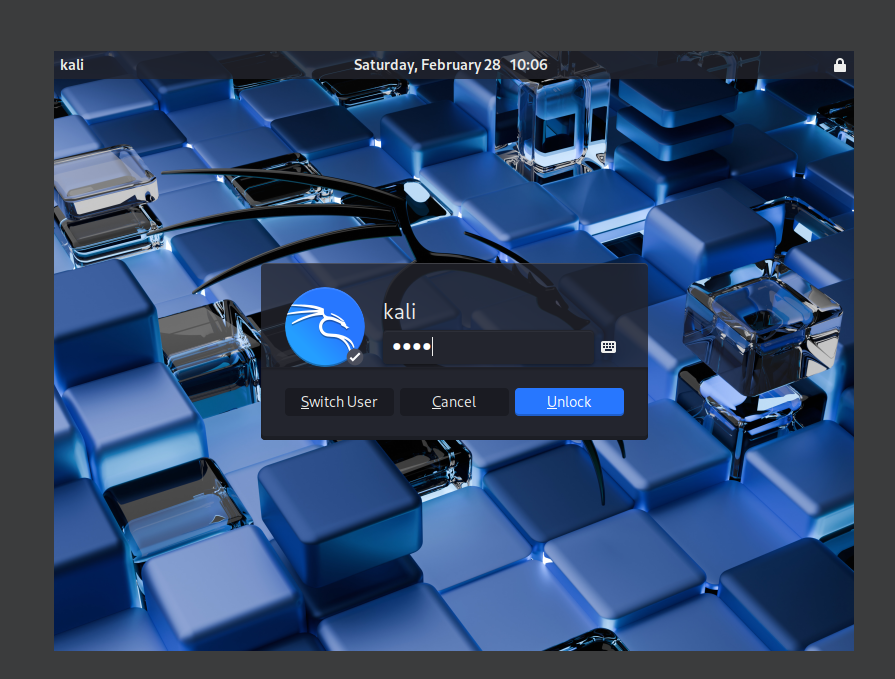

---
## Author
author:
  name: Панина Жанна Валерьевна
  degrees: bachelor
  orcid: 
  email: 1132246710@rudn.ru
  affiliation:
    - name: Российский университет дружбы народов
      country: Российская Федерация
      postal-code: 
      city: Москва
      address: ул. Миклухо-Маклая, д. 6

## Title
title: "Индивидуальный проект"
subtitle: "1 Этап"
license: "CC BY"
---

# Цель работы

Научиться основным способам тестирования веб приложений

# Задание

Найти максимальное количество уязвимостей различных типов. Реализовать успешную эксплуатацию каждой уязвимости.

# Теоретическое введение

- Ищутся уязвимости в специально предназначенном для этого веб приложении под названием Damn Vulnerable Web Application (DVWA).
- Назначение DVWA — попрактиковаться в некоторых самых распространённых веб уязвимостях.
- Предлагается попробовать и обнаружить так много уязвимостей, как сможете.

# Выполнение работы 

Заожу на официальный сайт Kali Linux и устанавливаю необходимый дистрибутив ([рис. @fig-001]). Выбираю Virtual Machies ([рис. @fig-002]), VirtualBox в качестве среды виртуализации ([рис. @fig-003])

{#fig-001 width=70%}

{#fig-002 width=70%}

{#fig-003 width=70%}

Распаковываю архив и открываю файл .vbox ([рис. @fig-004]).

{#fig-004 width=70%}

Вижу созданную виртуальную машину Kali ([рис. @fig-005]).

{#fig-005 width=70%}

Ввожу учётные данные по умолчанию: логин root и пароль toor ([рис. @fig-006]).

{#fig-006 width=70%}

К сожалению, под этими данными войти не удалось, поэтому использую логин kali и пароль kali ([рис. @fig-007]).

{#fig-007 width=70%}

# Вопросы

1. Основные уязвимости веб-приложений:
SQL-инъекции, XSS (межсайтовый скриптинг), CSRF (межсайтовая подделка запроса), ошибки аутентификации, ошибки контроля доступа, небезопасная конфигурация сервера.

2. Можно ли ставить DVWA на публичный сервер?
Нет. Damn Vulnerable Web Application содержит специально созданные уязвимости и предназначен только для учебной среды.

3. Отличие тестирования DVWA от тестирования публичного сервера:
DVWA тестируется в учебных целях с известными уязвимостями; тестирование публичного сервера требует разрешения владельца и проводится по правилам безопасности.

4. Что такое Kali Linux:
Kali Linux — специализированный дистрибутив Linux для тестирования безопасности и поиска уязвимостей.

5. Компоненты Kali Linux:

* Nmap — сканирование сети.
* Metasploit Framework — эксплуатация уязвимостей.
* Wireshark — анализ сетевого трафика.
* Burp Suite — тестирование веб-приложений.
* John the Ripper — проверка стойкости паролей.

# Выводы

Я установила дистрибутив Kali Linux на виртуальную машину.

# Список литературы{.unnumbered}

::: {#refs}
:::
