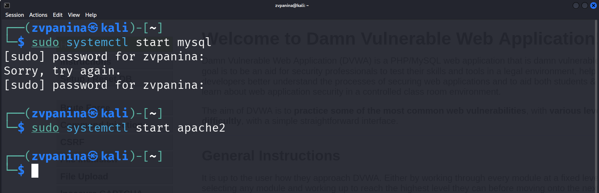
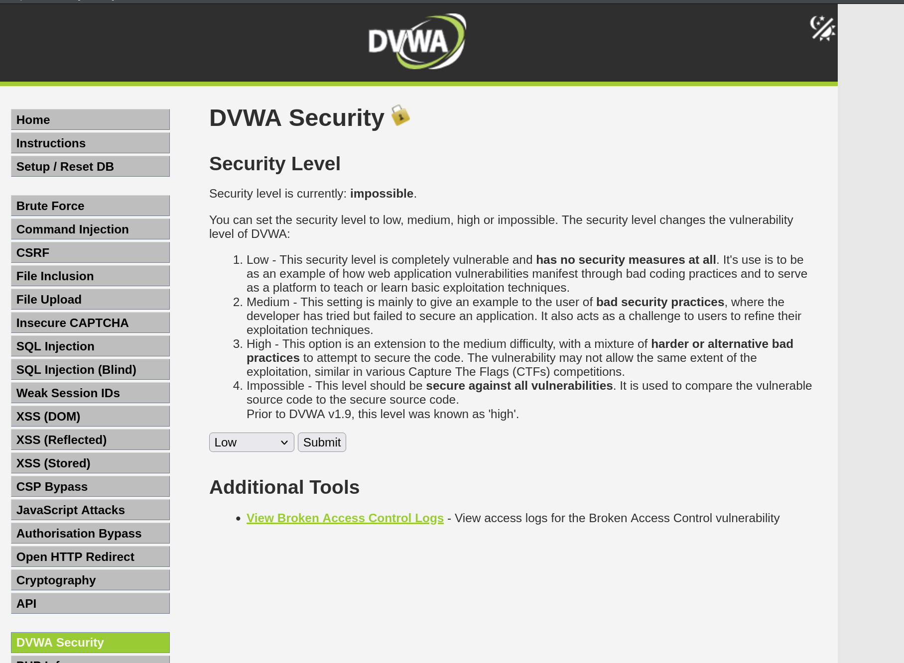
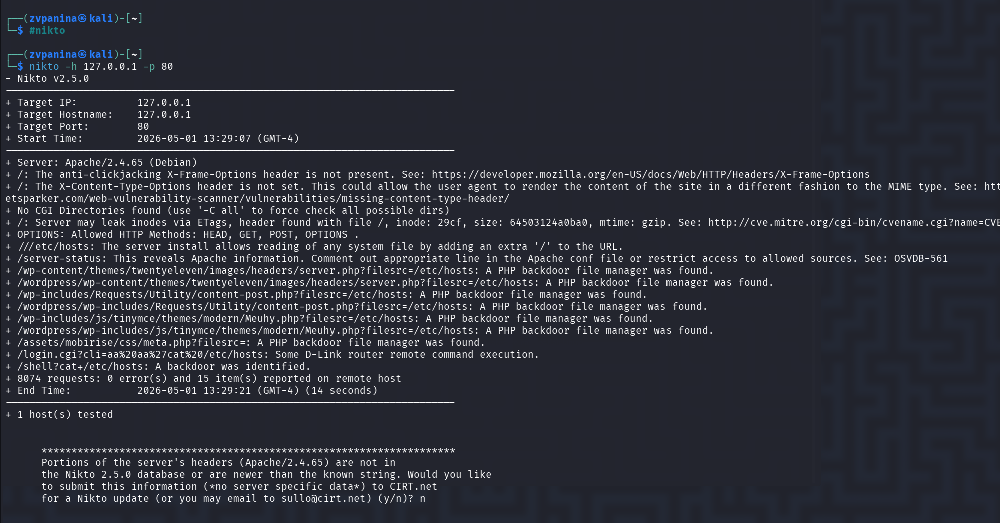
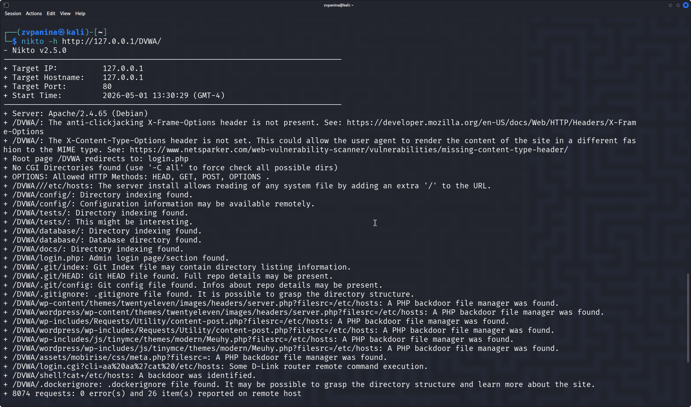
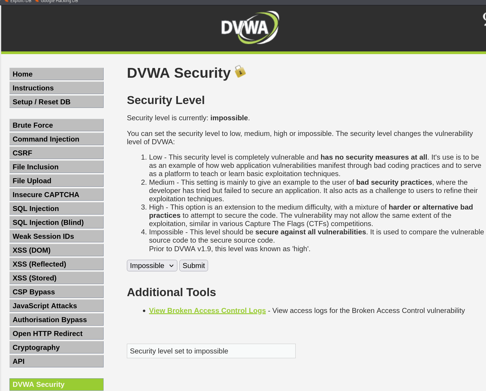
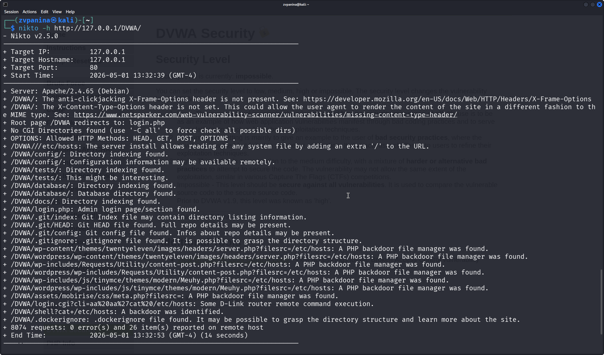

---
## Author
author:
  name: Панина Жанна Валерьевна
  degrees: bachelor
  orcid: 
  email: 1132246710@rudn.ru
  affiliation:
    - name: Российский университет дружбы народов
      country: Российская Федерация
      postal-code: 
      city: Москва
      address: ул. Миклухо-Маклая, д. 6

## Title
title: "Индивидуальный проект"
subtitle: "4 Этап. Использование nikto"
license: "CC BY"
---

# Цель работы

Научиться тестированию веб-приложений с помощью сканера nikto

# Задание

Просканировать веб-приложение, используя nikto

# Теоретическое введение

*nikto* — базовый сканер безопасности веб-сервера. Он сканирует и обнаруживает
уязвимости в веб-приложениях, обычно вызванные неправильной конфигурацией на самом сервере, файлами, установленными по умолчанию, и небезопасными файлами, а также устаревшими серверными приложениями. Поскольку nikto построен исключительно на LibWhisker2, он сразу после установки поддерживает кросс-платформенное развертывание, SSL (криптографический протокол, который подразумевает более безопасную связь), методы аутентификации хоста (NTLM/Basic), прокси и несколько методов уклонения от идентификаторов. Он также поддерживает перечисление поддоменов, проверку безопасности приложений (XSS,
SQL-инъекции и т. д.) и способен с помощью атаки паролей на основе словаря
угадывать учетные данные авторизации. 

Для запуска сканера nikto введите в командную строку терминала команду:
`# nikto`

По умолчанию, как ранее было показано в других приложениях, при обычном
запуске команды отображаются различные доступные параметры. Для сканирования цели введите `nikto -h <цель> -p <порт>`, где <цель> — домен или IP-адрес
целевого сайта, а <порт> — порт, на котором запущен сервис 

Сканер nikto позволяет идентифицировать уязвимости веб-приложений, такие
как раскрытие информации, инъекция (XSS/Script/HTML), удаленный поиск
файлов (на уровне сервера), выполнение команд и идентификация программного
обеспечения. В дополнение к показанному ранее основному сканированию nikto
позволяет испытателю на проникновение настроить сканирование конкретной
цели. Рассмотрим параметры, которые следует использовать при сканировании.
- Указав переключатель командной строки -T с отдельными номерами тестов,
можно настроить тестирование конкретных типов.
- Используя при тестировании параметр -t, вы можете установить значение
тайм-аута для каждого ответа.
- Параметр -D V управляет выводом на экран.
- Параметры -o и -F отвечают за выбор формата отчета сканирования.

Существуют и другие параметры, такие как -mutate (угадывать поддомены,
файлы, каталоги и имена пользователей), -evasion (обходить фильтр идентификаторов) и -Single (для одиночного тестового режима), которые можно использовать для углубленной оценки цели [@parasram].

# Выполнение работы

Запускаю mysql и apache2  ([рис. @fig-001]).

{#fig-001 width=70%}

Ввожу в адресной строке браузера адрес DVWA и перехожу в режим выбора уровня безопасности, сначала поставлю минимальный - Low ([рис. @fig-002]).

{#fig-002 width=70%}

Запускаю nikto и проверяю веб-приложение, ввелдя сначала адрес хоста и порта ([рис. @fig-003]).

{#fig-003 width=70%}

Теперь пробую просканировать, введя полный URL-адрес ([рис. @fig-004]). Результаты незначительно отличаются.

{#fig-004 width=70%}

Попробую проделать теперь то же самое, изменив уровень безопасности на impossible ([рис. @fig-005]).

{#fig-005 width=70%} 

Повторив предыдущую команду, я не заметила изменений в выводе информации ([рис. @fig-006]).

{#fig-006 width=70%}

## Анализ результатов сканирования

Кроме адреса хоста и порта веб-приложения, nikto выводит инофрмацию о различных уязвимостях приложения:

Сервер: Apache/2.4.58 (Debian)
+ /DVWA/: Заголовок X-Frame-Options, защищающий от перехвата кликов, отсутствует. Смотрите: https://developer.mozilla.org/en-US/docs/Web/HTTP/Headers/X-Frame-Options

+ /DVWA/: Заголовок X-Content-Type-Options не задан. Это может позволить пользовательскому агенту отображать содержимое сайта способом, отличным от MIME-типа. Смотрите: https://www.netsparker.com/web-vulnerability-scanner/vulnerabilities/missing-content-type-header/

+ Корневая страница /DVWA перенаправляет на: login.php

+ Каталоги CGI не найдены (используйте '-C all', чтобы принудительно проверить все возможные каталоги)

+ ОПЦИИ: Разрешенные HTTP-методы: GET, POST, OPTIONS, HEAD .

+ /DVWA///etc/hosts: Установка сервера позволяет считывать любой системный файл, добавляя дополнительный "/" к URL-адресу.

+ /DVWA/config/: Найдена индексация каталога.

+ /DVWA/config/: Информация о конфигурации может быть доступна удаленно.

+ /DVWA/tests/: Найдена индексация каталога.

+ /DVWA/tests/: Это может быть интересно.

+ /DVWA/database/: Найдена индексация каталога.

+ /DVWA/база данных/: Найден каталог базы данных.

+ /DVWA/документы/: Найдена индексация каталога.

+ /DVWA/login.php: Найдена страница входа администратора/раздел.

+ /DVWA/.git/index: Индексный файл Git может содержать информацию о списке каталогов.

+ /DVWA/.git/HEAD: Найден файл Git HEAD. Может содержаться полная информация о репозитории.

+ /DVWA/.git/config: Найден конфигурационный файл Git. Может содержаться информация о деталях репозитория.

+ /DVWA/.gitignore: найден файл .gitignore. Можно разобраться в структуре каталогов.

+ /DVWA/wp-content/themes/twentyeleven/images/headers/server.php?filesrc=/etc/hosts: Обнаружен файловый менеджер с бэкдором на PHP.

+ /DVWA/wordpress/wp-content/themes/twentyeleven/images/headers/server.php?filesrc=/etc/hosts: Обнаружен файловый менеджер с бэкдором на PHP.

+ /DVWA/wp-includes/Requests/Utility/content-post.php?filesrc=/etc/hosts: Найден файловый менеджер с бэкдором на PHP.

+ /DVWA/wordpress/wp-includes/Requests/Utility/content-post.php?filesrc=/etc/hosts: Найден файловый менеджер с бэкдором на PHP.

+ /DVWA/wp-включает в себя/js/tinymce/themes/modern/Meuhy.php?filesrc=/etc/hosts: Найден файловый менеджер бэкдора PHP.

+ /DVWA/wordpress/wp-включает в себя/js/tinymce/themes/modern/Meuhy.php?filesrc=/etc/hosts: Найден файловый менеджер бэкдора на PHP.

+ /DVWA/assets/mobirise/css/meta.php?filesrc=: Найден файловый менеджер бэкдора на PHP.

+ /DVWA/login.cgi?cli=aa%20aa%27cat%20/etc/hosts: Удаленное выполнение какой-либо команды маршрутизатором D-Link.

+ /DVWA/shell?cat+/etc/hosts: Обнаружен черный ход.

+ /DVWA/.dockerignore: найден файл .dockerignore. Возможно, удастся разобраться в структуре каталогов и узнать больше о сайте.

Бэкдор, тайный вход (от англ. back door — «чёрный ход», «лазейка», буквально «задняя дверь») — дефект алгоритма, который намеренно встраивается в него разработчиком и позволяет получить несанкционированный доступ к данным или удалённому управлению операционной системой и компьютером в целом. 

Также в результатах nikto отображает код OSVDB 561 и дает ссылку на CVE-2003-1418. OSVDB — это аббревиатура
базы данных уязвимостей с открытым исходным кодом.

CVE-2003-1418 — это уязвимость в Apache HTTP Server 1.3.22–1.3.27 на OpenBSD, которая позволяет удалённым злоумышленникам получать конфиденциальную информацию через:

- Заголовок ETag, который раскрывает номер вode.

- Многочастную границу MIME, которая раскрывает идентификаторы дочерних процессов (PID).

В настоящее время эта проблема имеет среднюю степень тяжести.

# Выводы

В ходе работы я научилась использовать сканер nikto для тестирования веб-приложений.

